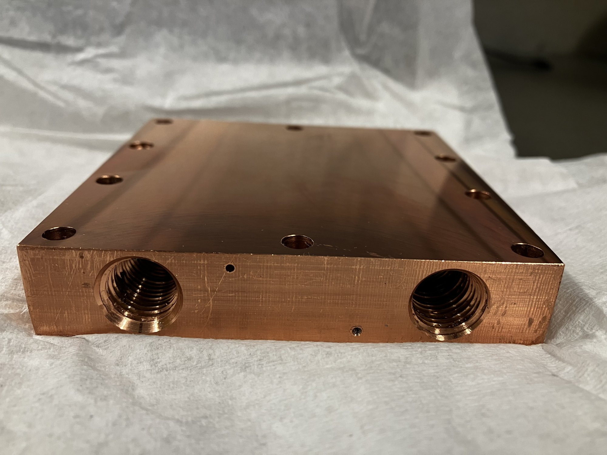
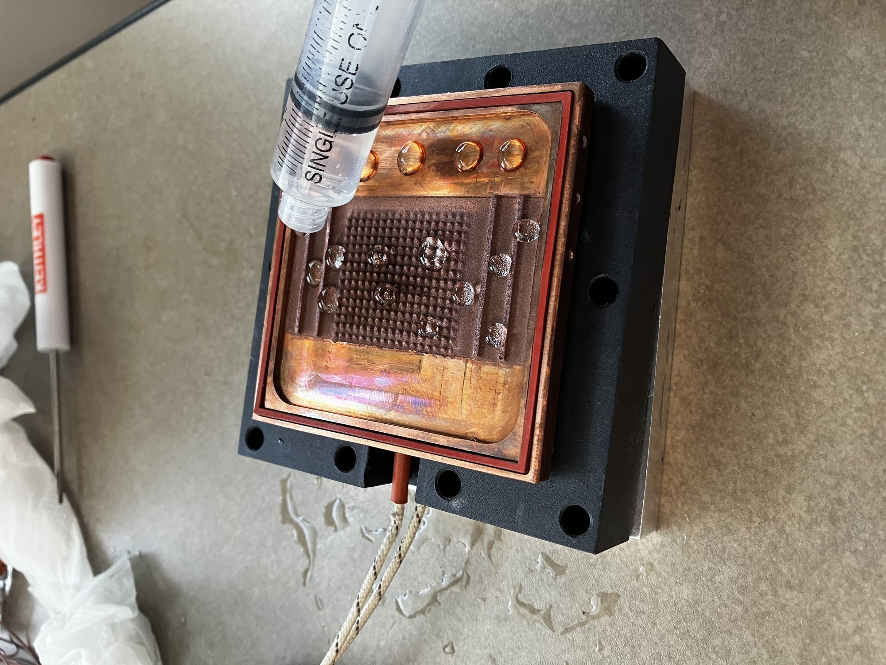
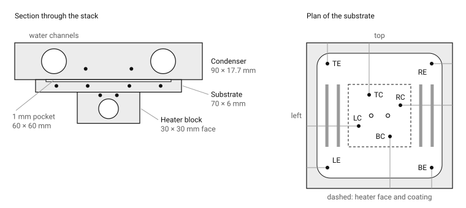
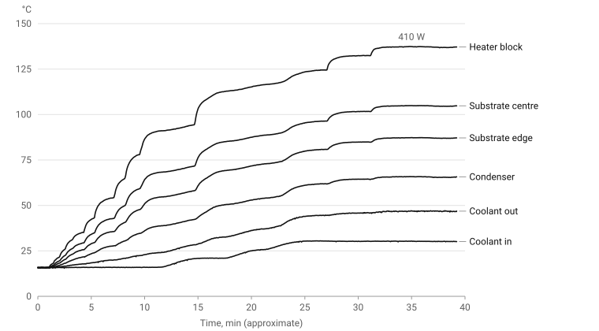
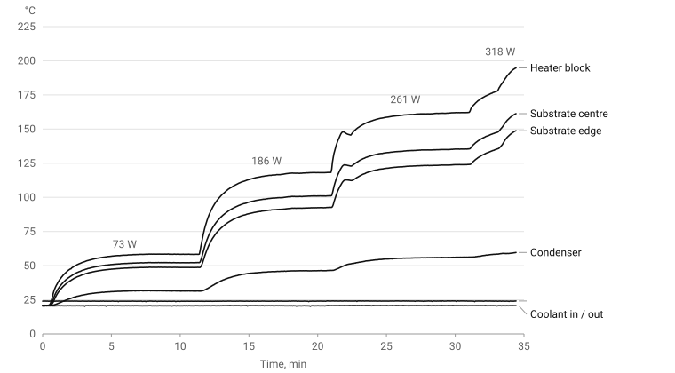

*Figure 1. The condenser block as machined: two of the four 1/4 NPT water ports, ten clamp holes on the 85 mm pattern, and the thermocouple bores entering from the side faces.*

## Summary

A wickless flat-plate heat pipe under development at the Centre for Advanced Coating Technologies pumps fluid with a wire-arc-sprayed asymmetric sawtooth coating instead of a capillary wick. The previous build had a polycarbonate top plate that could not condense vapor, identified as the root cause of the device never reaching steady state. This report covers the replacement: a C110 copper condenser designed and machined to a GD&T drawing, the thermocouple and DAQ instrumentation of the assembly, and two tests: one with the chamber charged with water and a control with it dry. Charged, the device reached steady state at 410 W and the chiller water carried away the electrical input, to within 7% at that point and about 20% over the run. The resistance from substrate to condenser was 0.074 K/W, against 0.26 to 0.28 K/W dry. The substrate was not uniform: the centre ran 18 °C above the edge, and that gradient per watt was the same charged and dry. The charged resistance is lower than conduction through the liquid would give, consistent with the two-phase cooling the chamber is designed for. The flow inside the chamber and its distribution across the plate are not resolved by these thermocouples. A 2-D conduction model of the plate, fitted to the eight substrate thermocouples, recovers the heater power to within 8% and is used to animate the temperature field. Two measurement corrections and a known bypass in the chamber are identified, and the next experiments are specified.

| Item | Detail |
| --- | --- |
| Organisation | Centre for Advanced Coating Technologies (CACT), University of Toronto |
| Period | May 2026 to present, research placement |
| Role | Design, machining, instrumentation and testing of the condenser |
| Deliverables | Drawing FPHPM2601 (Appendix A), the machined block, a calibrated 14-channel thermocouple map, the charged and dry test logs |
| Tools | SolidWorks with GD&T, manual mill and drill press, NPT tapping, Omega OMB-DAQ-56 with thermocouple expansion modules, chiller, DC power supply |

## 1. Background

Modern chips produce heat fluxes that air cooling cannot remove. Vapor chambers spread that heat by evaporation and condensation, but conventional ones need a porous wick to return liquid to the hot spot. Wicks are expensive, add thickness, and fail when they dry out or clog.

The lab's approach removes the wick. An asymmetric sawtooth microstructure, sprayed onto copper, makes vapor bubbles nucleate on the long slope of each tooth. The different interface curvatures on the long and short slopes give a net Young-Laplace pressure that pushes vapor slugs in one direction. On the lab's loop heat pipe rig the thesis student had already measured that pressure directly, about 204 Pa at steady state, consistent with a 196 to 392 Pa estimate from hydrostatic head. From those results the design fixed a 200 µm air gap above the coating and a spray recipe of 9 passes for a target 1000 µm pillar height.

*Figure 2. The vapor chamber substrate with the sprayed sawtooth structure, the laser-cut silicone gasket and the thermocouple leads, being filled by syringe.*

The flat-plate device built from those results never reached steady state. Internal pressure climbed to the 25 psi relief valve and the flow became valve-driven. The polycarbonate top plate, with a conductivity around 0.2 W/m·K, gave almost no condensing surface. A copper condenser was the identified fix.

## 2. Objectives

1. Design a copper condenser that mates with the existing substrate, gasket and clamp plate, seals at 25 psi, and carries chiller water close to the vapor-side face.
2. Machine it in-house on a manual mill from solid C110.
3. Instrument the heater block, substrate and condenser with calibrated thermocouples on a DAQ so the spatial gradient can be read directly from the log.
4. Run the heater-to-chiller test, with a dry control, and establish whether the chamber moves heat to the condenser.

## 3. Condenser design

### 3.1 Design basis and alternatives

The condenser combines two earlier designs from the lab: the polycarbonate top plate's sealing arrangement from J. Faria's thesis, and the coolant cavity of M. Ma's condenser. Two versions were drawn with GD&T, one for 3/8 NPT fittings and one for 1/4 NPT push-to-connect fittings, each with two thermocouple bores. The 1/4 NPT version was chosen because the copper stock available set the block thickness, and the 3/8 NPT port did not fit within it.

### 3.2 Geometry

| Feature | Specification | Purpose |
| --- | --- | --- |
| Block | 90 × 90 × 17.7 mm, C110 copper | Matches the substrate footprint; copper for the condensing surface |
| Water channels | 2 × Ø11.92 mm, straight through the block on the mid-plane; each tapped 1/4 NPT at both ends, with 55.86 mm of plain bore between the ports | Chiller loop close to the vapor-side face |
| Ports | 1/4 NPT: Ø11.13 mm tap drill, 17.07 mm deep, 100° countersink | Push-to-connect fittings seal on the taper without a gasket |
| Clamp holes | 10 × Ø5.30 mm through, on the 85 mm bolt pattern | Clamps the stack against the existing plate |
| Thermocouple bores | 2 × Ø1.20 mm, 25 mm deep | Beads on known lines between the vapor-side face and the water channels |

### 3.3 Tolerancing

The drawing carries the tolerances that matter for the assembly rather than blanket tight limits.

- Datum A is the vapor-side face. The bolt pattern and the channel ports carry Ø0.5 mm positional tolerances to A, B, C so the block lines up with the existing substrate, gasket and clamp plate.
- The vapor-side face has to be flat enough for the gasket to seal at 25 psi and for the contact with the chamber to conduct. The drawing controls it, but flatness was not measured after machining. This is addressed in Section 7.
- General tolerances are 0.1 mm linear and 0.5° angular.

## 4. Manufacturing

The block was machined from solid on a manual mill over one week.

| Day | Operations |
| --- | --- |
| 1 | Block squared to size in x and y |
| 2 | Faced to thickness in z; M5 clearance holes on the bolt pattern; channel positions centre-drilled |
| 3 | Thermocouples checked against ice water and boiling water (Section 5.1) |
| 4 | Channel bores drilled; ports tapped 1/4 NPT for push-to-connect fittings |
| After | Thermocouple bores; sealing face finished with light, shallow passes to keep it flat |

The Ø1.2 mm thermocouple bores, 25 mm deep, were the hardest operations. A small drill at that depth in gummy copper grabs. One bit broke and lodged in the part. The remaining bores were drilled on the mill with short pecks, clearing chips between each, and went through cleanly.

## 5. Instrumentation and test rig

### 5.1 Thermocouples and DAQ

| Item | Detail |
| --- | --- |
| Channels | 14 thermocouples across the heater block, substrate and condenser |
| Acquisition | Omega OMB-DAQ-56 with thermocouple expansion modules |
| Calibration | Two points per channel before installation: ice-water bath at 0 °C and boiling water at 100 °C |
| Channel map | Leads labelled to channel so the spatial gradient reads straight off the log |
| Scan rate | 0.6 Hz in the dry control. About 0.66 Hz in the charged run, where the rate was not recorded |

*Figure 5. Where the beads sit. The section is cut across the water channels. The condenser beads are shown at a nominal height. In the plan, the grey bars are the sprayed channel walls and the open circles are the heater block beads, below the plate.*

| Location | Channels | Bead position |
| --- | --- | --- |
| Heater block | 2: left and right | 1.5 mm below the 30 × 30 mm contact face |
| Substrate, four sides (left, top, right, bottom) | 8: one edge and one centre on each side | On the mid-plane of the 6 mm plate, 2 mm below the pocket floor. Centre beads are 25 mm in from the side, over the heater block. Edge beads are 10 mm in, near the corners of the pocket and outside the heater footprint. The middle bore on each side was not used |
| Condenser | 2: left and right | 25 mm in from opposite side faces, between the two water channels |
| Chiller water | 2: condenser inlet and outlet | In the water lines |

The heater block, substrate and gasket are J. Faria's design and the positions above are from those drawings. The sawtooth coating covers the 30 × 30 mm over the heater block. The bottom-side bores, the heater block bores and the channels beside the coating all run in the same direction.

*Figure 3. The DAQ with expansion modules and the labelled thermocouple leads.*

*Figure 4. Two-point calibration of the thermocouples against an ice bath.*

### 5.2 Test rig

A copper heater block stands in for the chip, driven by a DC power supply. Its contact face is 30 × 30 mm, so 410 W is 46 W/cm². The vapor chamber substrate with its gasket sits on the heater block. The condenser sits on top, plumbed to a chiller through the NPT ports. The DAQ logs all channels.

### 5.3 Planned measurements

- Temperature uniformity across the vapor chamber. Hypothesis: without a heat sink the substrate shows a gradient from centre to edge; with the condenser fitted the gradient falls below 1 °C.
- Condenser inlet and outlet temperatures, for the heat rejected to the chiller.
- Thermal resistance of the system, heater to condenser.
- Heat sink efficiency, from the rejected heat against the electrical input.

## 6. Results

Two runs were logged. On 2026-05-27 the chamber was charged with water at the 70% fill ratio of the thesis, 2.7 mL in a 3.9 mL channel, and the heater was stepped up to 410 W (118 V, 3.47 A), with 380 mL/min of chiller water and the inlet raised in steps to 30 °C. On 2026-09-23 the same assembly was run dry as a control, at four heater powers from 73 W to 318 W, with the chiller set to 20 °C and the flow at 600 mL/min, falling to 580.

### 6.1 Charged chamber, 410 W

*Figure 6. The charged test. Each line is the mean of the thermocouples at that location. The power was stepped up by hand and only the final step, 410 W, was recorded. The time axis assumes 0.66 Hz.*

The device reached steady state. Between the start and the end of the last five minutes no channel moved by more than 0.2 °C.

| Location | Steady temperature, °C |
| --- | --- |
| Heater block, left and right | 135.8, 138.1 |
| Substrate centre: left, top, right, bottom | 98.1, 109.0, 107.9, 103.4 |
| Substrate edge: left, top, right, bottom | 82.1, 90.7, 92.4, 82.8 |
| Condenser, left and right | 66.0, 65.0 |
| Chiller water, out and in | 46.7, 30.2 |

The chiller water rose 16.6 °C across the condenser. At 380 mL/min that is 437 W, against 410 W of electrical input. The balance closes at 107%. The coolant cannot carry more heat than the heater supplies, so the 7% is the combined error of the flow reading and the two water thermocouples. Within that error, all of the heat left through the condenser.

Earlier in the run the balance is less tidy. Between about minutes 17 and 27 the temperature drops inside the copper did not change, so the heater power did not. Over the same period the coolant pickup went from about 300 W to about 370 W as the inlet was raised from 21 to 30 °C. On that evidence the coolant measurement is good to about 20%, not 7%.

### 6.2 Dry control

*Figure 7. The dry control. The first three steps settled. The 318 W step was stopped with the heater block at 199 °C and still rising.*

The two chiller water channels did not respond in this run. They stayed at 20.7 and 24.1 °C through every step while the condenser block rose to 64 °C. At 600 mL/min, 261 W would warm the water by 6 °C. The channel labelled outlet read the chiller setpoint and the one labelled inlet read 3 °C above it, so they were not reading the water across the condenser and there is no energy balance for the control. The comparison below uses the condenser block temperature instead, which does not depend on them.

### 6.3 Thermal resistance

Each resistance is a temperature difference between location means divided by the electrical power.

| Run | Power, W | Heater to substrate, K/W | Substrate to condenser, K/W | Heater to condenser, K/W |
| --- | --- | --- | --- | --- |
| Charged | 410 | 0.100 | 0.074 | 0.174 |
| Dry | 73 | 0.109 | 0.260 | 0.369 |
| Dry | 186 | 0.115 | 0.271 | 0.387 |
| Dry | 261 | 0.124 | 0.282 | 0.406 |

The heater-to-substrate resistance is nearly the same charged and dry, as it should be, since the fluid is not in that path. The substrate-to-condenser resistance is 3.5 to 3.8 times lower with the chamber charged. The dry values are lower bounds: with no energy balance, some of the electrical power left to the room and did not cross to the condenser.

From heater block to chiller inlet the charged assembly is 0.26 K/W. The 107 °C between them at 410 W divides into three roughly equal parts.

| Step | Drop at 410 W, °C |
| --- | --- |
| Heater block to substrate centre | 32 |
| Substrate centre to condenser | 39 |
| Condenser to chiller inlet | 35 |

### 6.4 Uniformity

| Run | Power, W | Centre minus edge, °C | Per watt, mK/W | Spread over the 8 substrate channels, °C | Condenser left minus right, °C |
| --- | --- | --- | --- | --- | --- |
| Charged | 410 | 17.6 | 43 | 26.9 | 1.1 |
| Dry | 73 | 3.4 | 47 | 8.5 | 1.7 |
| Dry | 186 | 8.6 | 46 | 22.1 | 5.4 |
| Dry | 261 | 11.4 | 44 | 29.8 | 8.0 |

The sub-1 °C uniformity hypothesis of Section 5.3 was not met. The centre of the substrate ran 17.6 °C above the edge at 410 W. Per watt, the centre-to-edge gradient is the same charged and dry, so the substrate did not show the spreading the sawtooth structure is meant to produce.

### 6.5 Temperature field

Eight beads are enough to fit a conduction model of the plate, though not to map it directly. The substrate is treated as a 2-D copper plate, 6 mm thick and 5 mm under the pocket, with insulated edges:

$$\nabla \cdot (k\,t\,\nabla T) + q'' - g\,(T - T_\text{condenser}) = 0$$

The heat $Q$ enters uniformly over the 30 × 30 mm heater face. It leaves over the pocket to the condenser through one conductance per area, $g$. At every scan $Q$ and $g$ are fitted to the eight beads, with a linear tilt across the plate for whatever is not symmetric. The power is not an input. At the four steady states it comes back from the fit:

| Run | Electrical power, W | Power from the fit, W | $g$, W/m²K | RMS error at the beads, °C |
| --- | --- | --- | --- | --- |
| Charged | 410 | 441 | 4300 | 2.2 |
| Dry | 73 | 74 | 1100 | 1.1 |
| Dry | 186 | 198 | 1100 | 2.9 |
| Dry | 261 | 262 | 1000 | 4.5 |

The fit recovers the power to within 8% from temperatures alone, and in the charged run it lands on the same value as the coolant balance. So the centre-to-edge gradient of Section 6.4 is what 5 mm of copper gives when it carries that power outward, charged or dry. The chamber changes $g$, by a factor of four.

<video controls autoplay muted loop playsinline style="display:block;width:100%;border-radius:6px" src="/EngineeringPortfolio/projects/cact/cact_test1_field.mp4" aria-label="The charged run. A plan view of the substrate shows the fitted temperature field with isotherms growing outward from the heater face as the power steps up, with the eight thermocouples drawn as dots coloured by their measured value. Beside it a section of the stack shows the heater block, substrate, condenser and coolant temperatures."></video>

*Video 1. The charged run. The field is the fitted model. The dots are the measurements, so a dot that stands out from the field is where the model is wrong.*

<video controls autoplay muted loop playsinline style="display:block;width:100%;border-radius:6px" src="/EngineeringPortfolio/projects/cact/cact_control_field.mp4" aria-label="The dry control. The same view through four power steps. The substrate runs much hotter than the condenser and a left-to-right tilt grows with power."></video>

*Video 2. The dry control, on a wider colour scale.*

The fit assumes each scan is at steady state, and $Q$ and $g$ are only loosely separated by eight beads, so between the four checked points the fitted power is less certain than the table suggests and is not shown in the videos. The tilt is 14 °C across the plate in the charged run. In the dry run it is in a different direction and grows with power, to 30 °C at 261 W.

## 7. Discussion

The copper condenser did what it was built for. The previous build never reached steady state. This one held 410 W with every channel flat, and the heat arrived in the chiller water.

The chamber is one third of the total. The heater block and the centre substrate beads are 4.5 mm of copper apart, which at 46 W/cm² accounts for about 5 °C. The other 27 °C of that step is the thermal paste joint between them, and it is as large as anything the chamber does.

The sawtooth structure and the 70% fill are designed for two-phase cooling, and the numbers are consistent with it. Conduction through the liquid alone would not reach the measured resistance. Flooded to the top, the water would conduct 0.37 K/W across the 200 µm gap over the 30 × 30 mm coating and 0.8 K/W across the 1.2 mm depth of the rest of the pocket. In parallel with the 0.27 K/W dry path that gives 0.13 K/W. The measured 0.074 K/W is lower, at a 70% fill. That estimate takes the coating as solid copper and the gap as the design 200 µm, and neither was measured on this specimen. The substrate was between 82 and 109 °C. Where that sits against the saturation temperature depends on the chamber pressure, which was not logged.

The unresolved question is the flow inside the chamber and how it distributes across the plate. The thermocouples cannot answer it. The eight substrate beads are in 5 mm of copper, and Section 6.5 shows that the copper sets what they read: the same conduction model fits the charged and dry runs, with only $g$ changed. One uniform $g$ over the pocket fits the charged run to 2 °C, so these beads do not resolve where on the plate the vapor forms, where it condenses, or whether the liquid circulates through the channels as designed.

Two things are known to be wrong with the measurement.

1. Thermocouple position. Each bead sits inside the copper, not on the surface. With a known heat flux $q''$ and copper conductivity $k$ there is a linear gradient between the surface and the bead, so the surface temperature follows from the bead reading and the bead's distance $d$ from the surface on the drawing: $T_\text{surface} = T_\text{bead} + q'' d / k$. Raw bead temperatures were reported. The correction is small per channel but it is a systematic bias in the resistances of Section 6.3.
2. Interface contact. The condenser-to-chamber contact resistance was not characterised. Flatness was not measured, and no thermal interface material or contact pressure measurement was used. The gasket is designed to compress 0.2 to 0.25 mm, which leaves the rim of the substrate at or close to the condenser face, and the sprayed channel walls are meant to reach it. In the dry run the heat crosses through those copper contacts. The dry run shows the effect: the left of the condenser ran 8 °C hotter than the right at 261 W while the left of the substrate ran cooler, which is what better contact on the left would give. Charged, the two sides agreed to 1 °C.

Beyond the measurement, the chamber has a known bypass. The channel walls on the substrate do not touch the sawtooth structure, giving the vapor a lower-resistance path around the pump. That was flagged in the thesis but not fixed in the hardware tested here.

## 8. Recommendations

1. Log the chamber pressure, so the substrate temperatures can be placed against the saturation temperature.
2. Resolve the flow and its distribution across the plate. The beads in the copper cannot, so this needs a window insert in the condenser for visualisation, or thermocouples on the condenser face across the pocket, or a charged run on a substrate with no sawtooth structure for comparison.
3. Measure the flatness of the sealing face on a surface plate or with a dial indicator. Apply the thermocouple gradient correction of Section 7 and recompute the resistances from the existing logs.
4. Repeat the dry control with the water thermocouples in the stream, so the heat crossing the dry chamber is measured and not bounded.
5. Record the power at every step. The charged log has eleven steps and one known power.
6. Close the bypass by revising the channel boundary to contact the sawtooth structure.

## 9. Conclusions

The copper condenser was designed, machined and installed, and the assembly was instrumented and tested end to end. With it the device reaches steady state at 410 W and the heat arrives in the chiller water. Charging the chamber lowers the substrate-to-condenser resistance from at least 0.26 K/W to 0.074 K/W. That is more than conduction through the liquid would give, as expected of a chamber designed for two-phase cooling. The substrate is not isothermal, and its in-plane gradient is what the copper plate alone gives. The flow inside the chamber and its distribution across the plate remain unresolved, and the recommendations start there.

This was the first part I made to a drawing I wrote, with tolerances that came from the mating parts rather than from habit, and then had to live with in a test.

## Appendix A. Condenser drawing

[Drawing FPHPM2601, PDF](/EngineeringPortfolio/projects/cact/cact_condenser_drawing.pdf). The drawing defines datum A as the vapor-side face, the Ø0.5 mm positional tolerances on the bolt pattern and ports, and the general tolerances of 0.1 mm and 0.5°.
