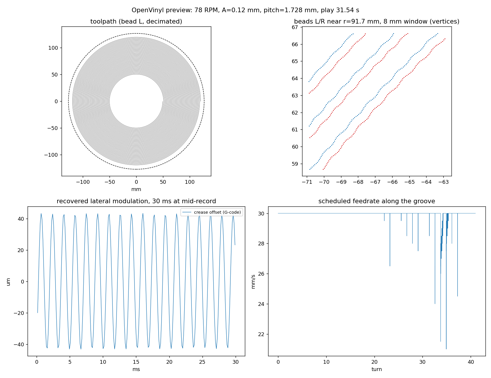
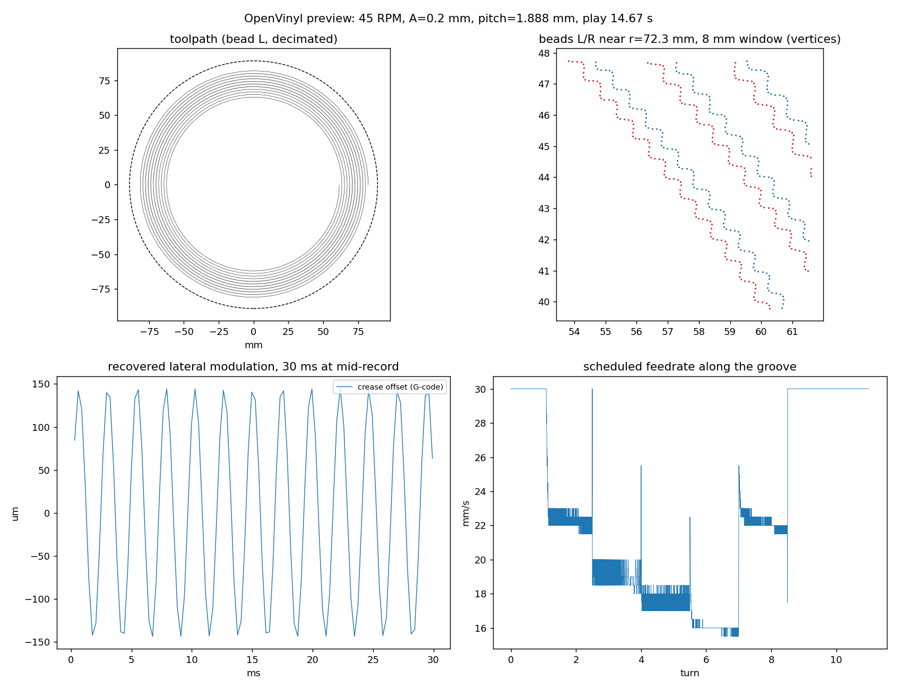
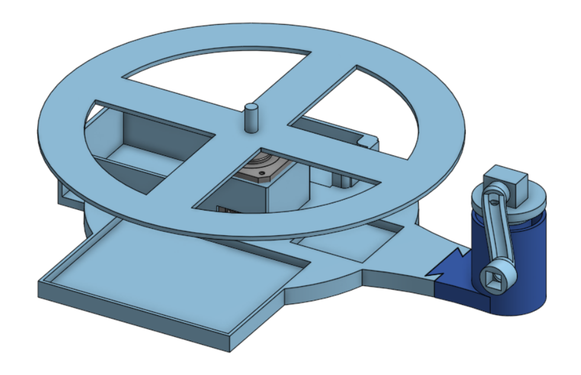
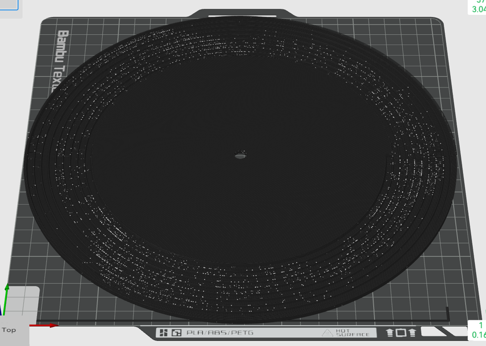

OpenVinyl turns digital audio into groove geometry on records printed on a hobby FDM printer, played back on a turntable I designed with two collaborators. v1 worked, barely. This month I went back to first principles and reversed its central design decision. v2 is still a work-in-progress, and I plan to print it and run tests in September 2026.

## The pivot

**v1 put the audio in groove depth because the bead looked too wide for a sideways wiggle. The bead was the wrong thing to be worried about.**

v1 encoded audio as groove depth because an FDM bead is 0.48 mm wide, so a lateral wiggle looked impossible at 10 to 20 times the width of a real vinyl groove. That argument was right about the bead and wrong about the conclusion. It assumed the geometry would go through a slicer, and a slicer can only reproduce what a mesh describes at bead resolution. If the encoder writes the G-code itself, the bead can be placed to about 0.01 mm even though it is 0.48 mm wide. Modulation is displacement, not feature size.

So v2 is a lateral cut, emitted directly as G-code, on the printer's fast and precise XY axes. Layer-height quantization disappears, slicer segment merging disappears, the staircase noise disappears, the ceramic cartridge works in its designed direction, and the groove pass prints in about 25 minutes instead of hours. The constraint was in the FDM slicer. v2 goes one level lower, so printer precision, and FDM physics are constraints.

## What v1 got right

**The contact mechanics, the slope limit and the habit of deriving everything from two hardware numbers all carry over unchanged.**

- **Hertzian contact.** An 18 µm LP stylus at 4 g on PLA peaks near 700 MPa, about 14x the yield stress. First play plastically sets the groove. A 3 mil (76 µm) 78-RPM tip cuts peak pressure by about 2.6x, to about 270 MPa, because pressure scales as $R^{-2/3}$. That is still over 5x yield.
- **Slope constraint.** $A \cdot f \leq \tan(\theta_{\max}) \cdot v / 2\pi$. At 78 RPM, $r = 40$ mm and 45°, this is $A \cdot f \leq 52$ mm·Hz.
- **Radius-dependent bandwidth.** Outer turns get 3x the inner turns on a 10 inch disc.
- **The compressor** to fit the amplitude budget, and the three-tier validation: melody recognition, SNR, pitch accuracy.
- **The habit** of deriving every parameter from two hardware inputs and listing what is unmeasured in a living parameters file.

## Slicer constraint based assumptions in v1

**Half of v1's parameters were consequences of the slicer. Each one was re-derived or dropped.**

| v1 item | v2 verdict | Reason |
| --- | --- | --- |
| Z modulation | Dropped | See above. Also, Z on the P1S is the heavy bed on leadscrews; modulating it mid-print would force ~3 mm/s feedrates. |
| 4-bit depth from 0.08 mm layers | Gone | Nothing is quantized. Dynamic range is set by XY repeatability, assumed 0.01 mm, so about 20 dB at $A = 0.1$ mm. |
| Slicer minimum segment length | Closed by construction | Segment length is a parameter of the emitter, 0.1 mm default. |
| 300 Hz highpass | To be re-derived by listening | It came from "no harmonics inside 681 to 2042 Hz". In a lateral cut, low frequencies are the easy ones, since slope scales with $f$. Any highpass now exists for amplitude budget: bass eats amplitude, and pitch pays for $2A$. Default drops to 100 to 150 Hz. |
| $\theta_{\max} = 45°$ | Kept as a parameter, number unearned | In lateral the limit is probably the stylus riding up the bead flank plus cantilever resonance, not a tangent angle. Measured by the amplitude-ladder disc. |
| Nyquist from steps per revolution | Replaced by nozzle smear | A feature shorter than one bead width along the path is averaged out: $f_{\text{smear}} = v / w_e$. Same numbers v1 got, 680 Hz inner and 2 kHz outer, because it is the same physics. A 0.2 mm nozzle doubles it. |
| Staircase noise at $v/h$ | Gone | No staircase in a planar groove. New periodic noise source: bead-edge ripple from extrusion pulsing, unmeasured. |
| Cartridge as a given | Now a design variable | Ceramic stays because it is displacement-proportional, so no RIAA and no pre-emphasis. Tip radius and compliance can be chosen for a 0.5 mm crease. |
| Constant RPM | CAV first, CLV designed for | See below. |
| Fixed pitch | Variable pitch later | Cutting lathes vary spacing with the signal envelope. We write the G-code, so we can too. |
| "12 inch" 254 mm disc | It is a 10 inch | A 12 inch LP is 302 mm and does not fit a 256 mm bed. |

Questioned and kept as scope rather than physics: a mechanical needle (optical readout would remove contact mechanics but stops being a record), and FDM itself (resin at 35 µm pixels would win on fidelity, but the point is FDM on the printer we own).

## The v2 groove

**Two beads per turn, 1.1 bead widths apart, so a V-crease forms between them. Both beads wiggle together and the stylus rides the crease.**

Both beads follow the same radial offset $x(\theta) = A \cdot \text{audio}(t)$ on top of a flat sliced disc. The stylus self-centres in the crease and reads $x$ as lateral displacement, which is what a ceramic cartridge is built to sense.

Pitch = bead spacing + bead width + $2A$ + land. Numbers from the encoder's own `info` command:

| Quantity | 10 inch, 78 RPM | 7 inch, 45 RPM |
| --- | --- | --- |
| Bead width $w_e$ | 0.48 mm | 0.48 mm |
| Bead spacing | 0.528 mm | 0.528 mm |
| Amplitude $A$ | 0.10 mm | 0.10 mm |
| Land | 0.48 mm | 0.48 mm |
| Pitch | 1.688 mm | 1.688 mm |
| Turns | 47 | 28 |
| Play time | 36 s | 37 s |
| Groove speed, inner / outer | 327 / 980 mm/s | 165 / 386 mm/s |
| Nozzle-smear bandwidth, inner / outer | 681 / 2042 Hz | 344 / 805 Hz |
| Stylus geometric limit, inner (3 mil tip) | 684 Hz | 345 Hz |
| $A \cdot f$ slope budget at inner radius, 45° | 52 mm·Hz (full amplitude legal to 520 Hz) | 26 mm·Hz |
| G-code segments per revolution, inner / outer | 2513 / 7539 | 2199 / 5152 |

A coincidence worth noting: with a 3 mil tip, $2\pi R = 0.478$ mm, almost exactly one bead width, so the stylus filter and the nozzle-smear filter land at the same frequency.

Play time is the price of the lateral cut: 36 s versus v1's 64 s on the same disc, because every pitch pays $2A$ plus land. 45 RPM gives about the same time at 0.5x the bandwidth. Variable pitch and CLV both claw time back.

## The encoder

**The software derives the groove, writes the G-code, then decodes that same file back into audio to prove it.**

- **Conditioning.** Mono, highpass, lowpass at the inner-radius smear limit, 6:1 compressor to 18 dB, normalize ignoring filter edge transients. The edge-transient bug silently scaled every record to 79% until the round-trip test caught it.
- **Sampling.** The spiral is sampled at constant arc length (0.1 mm), so outer turns get finer sampling automatically. v1's "per-turn adaptive bandwidth" extension is free on the geometry side.
- **Slope limiter.** Runs on $x(\theta)$ after mapping, because the bound depends on radius. Gain envelope is a running minimum over 1 mm, smoothed twice, iterated to convergence. Reports the fraction of samples touched.
- **Feedrate scheduling.** Printer XY acceleration bounds $A \cdot f$ exactly like the stylus does, and print speed is the free knob. Each segment's speed is set from the bead centreline curvature ($v^2 \kappa \leq 2000$ mm/s²) with 1 mm lookahead, capped at 30 mm/s. Loud passages print slowly, quiet ones fast. This is the print-time optimizer.
- **Base disc.** Sliced in Bambu Studio and exported as G-code. The tool reads disc top Z, centre and extrusion mode from the export and inserts the groove before the end G-code, reusing the printer's own start sequence, bed levelling and purge.
- **Self-describing G-code.** Every parameter is written as `; OV key=value` comments and each bead pass is labelled. The preview decodes the file that goes to the printer back into a WAV and a PNG. Tests check the decoded signal matches the internal one to under 2 µm.
- **Validation gate.** Exit code 2 if any check fails: bed bounds, minimum segment length, volumetric flow, planner segment rate, feedrate range, groove slope, land width, inner radius, disc fits bed, outer bead inside disc.

The four panels above are decoded from the G-code file itself, not from the encoder's internal state. Top right is the pair of beads near mid-record with the wiggle visible. Bottom left is the modulation the stylus should see. Bottom right shows the feedrate only dipping where the melody gets loud.

The stress disc pushes the slope limiter and the feedrate scheduler on purpose. Each step of the ladder prints at a different speed, down to 15.5 mm/s in the steepest passage.

| Run | Result |
| --- | --- |
| 30 s synthetic melody, 10 inch, $A = 0.12$ mm | 41 turns, 21.8 m of groove, 4.75 g of filament, groove pass 24.4 min, slope limiter untouched, max slope 34.7° |
| 440 Hz tone, round trip through G-code | recovered 100.5 µm vs 100 µm commanded |
| Stress: ladder 300 to 680 Hz at $A = 0.2$ mm, 7 inch, 45 RPM | slope limiter touched 4.9% of samples, feedrate dropped to 15.5 mm/s, groove pass 8.9 min |

Printer profile numbers still to tune on hardware: 30 mm/s ceiling, 2000 mm/s² acceleration budget, 500 segments/s planner assumption, extrusion width factor 1.2, 1 mm bed margin for a 254 mm disc on a 256 mm bed.

## CAV or CLV

**A custom turntable can slow down as the needle moves inward, like a CD. That is worth about 1.6x the audio at the same worst-case quality.**

CAV, constant angular velocity, is fixed RPM like every vinyl record. Groove speed under the stylus varies 3x from outer to inner turn, so bandwidth, slope budget and print resolution per second all vary 3x, and the whole disc is designed for the worst inner turn.

CLV, constant linear velocity, slows the platter as the stylus moves inward so groove speed is constant. Every turn has the same bandwidth and slope budget, and inner turns hold as much time as outer ones. It is only possible because the turntable is custom: the controller needs stylus position, either from elapsed time after a start trigger (the file knows radius versus time) or from an arm sensor.

Decision: first records are CAV so speed control is not a variable during tracking experiments. The motor controller is designed so it can ramp.

## The test ladder

**One print, one question. The dominant risk in v2 is tracking, not bandwidth.**

Neither v1's analysis nor the first v2 plan addressed whether a stylus stays in a crease between two round FDM beads for 40 turns. Hence coupons first.

| # | Print | Question | Judged by |
| --- | --- | --- | --- |
| 1 | Straight bead-pair strips at spacing 1.0 / 1.1 / 1.2 / 1.3 $w_e$, 1 and 2 layers, blank | What does the crease look like, does a 3 mil tip sit in it | Macro photo of a section, needle dropped by hand, drag under a stationary cartridge |
| 2 | 7 inch blank-groove disc at best spacing | Tracks 30 turns without skipping? Noise floor? | Level 0 pass/fail, recorded spectrum |
| 3 | 7 inch 400 Hz tone, amplitude ladder 0.02 to 0.20 mm per turn | Where tracking breaks with amplitude: the real slope limit | Distortion or skip onset |
| 4 | 7 inch tone ladder 200 to 2000 Hz at fixed amplitude | Frequency response: smear and stylus filter measured | Level per step vs preview WAV |
| 5 | Two tones, then a short melody | Pitch survives? Recognizable? | Level 1 and Level 3 |

Level 0 is new to the validation tiers: the stylus tracks the full disc without skipping or riding out, judged before any audio content. Prints 1 and 2 only need something that spins; 3 onward need trustworthy RPM, so they wait for the rebuilt turntable rather than an improvised spinner.

## Open assumptions

- The P1S accepts a spliced plain `.gcode` from the SD card. Fallback: repack into a `.gcode.3mf`.
- Bambu Studio end-of-print markers, detected from memory, tested only against a synthetic base file.
- A 3 mil stylus in a 1.1 $w_e$ crease actually tracks.
- XY repeatability 0.01 mm, planner 500 segments/s, extrusion width factor 1.2.
- Bead-edge ripple spectrum, unmeasured.

## Phases

| Phase | Deliverable | State |
| --- | --- | --- |
| 0 | Package, tests, docs | Done |
| 1 | Lateral emitter, splice, first-order preview | Done, unprinted |
| 1.5 | Tracking coupons and a coupon command | Next |
| 2 | Deposition heightmap, sphere stylus and cartridge model simulator; per-radius lowpass | After coupons |
| 3 | Test discs 2 to 5 through the turntable, fit the simulator | Needs turntable |
| 4 | Turntable rebuild: closed-loop motor and encoder, RPM UI with CLV-capable ramp, ceramic preamp and line out on one PCB, printed platter, tonearm, swappable headshell | In progress |
| 5 | Variable pitch, CLV records, continuous-Z experiment branch | Later |

## v1: what was built and played

**A hill-and-dale record generated as a watertight 6.8 million triangle STL, sliced, printed, and played on a turntable built for it.**

  <iframe
    src="https://www.youtube.com/embed/aqkWe6JU3gI"
    style="position: absolute; top: 0; left: 0; width: 100%; height: 100%; border:0;"
    title="OpenVinyl v1 demo"
    allow="accelerometer; autoplay; clipboard-write; encrypted-media; gyroscope; picture-in-picture"
    allowfullscreen>
  </iframe>

The initial turntable was built by Samantha Chan (mechanical CAD) and Niegel Fernandes (electronics). Initial validation on it confirmed that the physical constraints predicted actual system behaviour: the inner-radius bandwidth limit, the slope-induced amplitude ceiling, and the first-play plastic deformation all appeared where the geometry analysis said they would. The playback transfer function was never measured, and the pipeline used a conservative global cutoff, so usable bandwidth on the outer grooves was left on the table. v2 gets both of those for free from the geometry.

In v1 the groove was a helical trench whose floor height varied in 0.08 mm steps. Every downstream parameter derived from two hardware inputs, nozzle diameter and layer height, and the signal processing was the last thing designed.

| | Inner radius (40 mm) | Outer radius (120 mm) |
| --- | --- | --- |
| Steps per revolution (0.2 mm nozzle) | 1,047 | 3,142 |
| Sample rate | 1,361 Hz | 4,085 Hz |
| Nyquist | 681 Hz | 2,042 Hz |

| Stage | Parameter | Derivation |
| --- | --- | --- |
| Highpass | 300 Hz, 4th-order Butterworth | Content below 300 Hz has no harmonics inside 681 to 2042 Hz |
| Lowpass | 681 Hz, 4th-order Butterworth | Inner-radius Nyquist as a conservative global cutoff |
| Compression | ≥ 6:1 | Fit 24 dB of input into the 18 dB the slope constraint allows |
| Dither | TPDF only | Zero Nyquist headroom, so noise shaping has nowhere to put the noise |

The 300 to 681 Hz passband means most musical fundamentals could not be encoded directly. The ear reconstructs pitch from harmonics 2 to 4 if the signal is monophonic and periodic, so the useful input range was roughly A4 to C#5.

### The mesh

The hard part of v1 was turning a waveform into a watertight, printable solid. The groove follows an Archimedean spiral $r_c(	heta) = r_0 - rac{p}{2\pi}	heta$. At each angular step the sample sets the floor height. The mesh must be a closed 2-manifold, every edge shared by exactly two triangles, or the slicer rejects it.

- **Six vertices per step:** outer and inner wall top at the surface, floor centre at $Z_{	ext{base}} + (s + n_{\min}) h$, outer and inner wall bottom at $Z = 0$, and the groove centre projected to land height. Consecutive steps form the quad strips for walls, floor and land.
- **About 10 triangles per step.** A 60-second record at 78 RPM with a 0.2 mm nozzle is 680,000 steps and 6.8 million triangles.
- **Four open boundaries to seal:** a start cap at the outer radius, an end cap at the inner radius with reversed winding (wrong winding reads as a hole), the outer rim to the record's edge, and the inner disk to the spindle hole.
- **Inter-turn bridging.** The land between one turn and the next must be triangulated too, which means indexing back one full revolution at every step. Skip it and each turn is a separate shell floating in space.
- **Sign convention.** High sample values map to a deeper floor, never above the surface, so turns can never self-intersect.

### Stylus contact

Hertzian contact between an 18 µm tip and PLA at 4 g: contact radius about 5.2 µm, peak pressure about 700 MPa, roughly 14x PLA's yield of about 50 MPa. The first play plastically sets the groove floor and effective depth resolution drops from 4 bits toward 3. Abrasive wear is a separate, much slower mechanism.

A spherical tip also cannot resolve floor features shorter than $2\pi R$ along the groove. For an 18 µm tip that limit sits about 4x above the print-limited Nyquist, so in v1 the printer, not the stylus, was the bottleneck. With a 3 mil tip in v2 the two limits coincide.

### Manufacturing limits that no longer apply

- **Z quantization.** 0.08 mm layers gave 16 levels over 1.28 mm, with the bottom 1 to 2 bits suspect at $\pm 0.02$ mm Z accuracy.
- **Slicer segment merging.** Inner-radius steps of 0.24 mm sat at the slicer's minimum segment length and were dropped from the G-code.
- **Staircase noise.** The layer staircase produced a tone at $v / h$, about 4 kHz at the inner radius.

All three are not relevant once the groove is written as G-code on the XY plane.

## References

- Ghassaei, A. (2012). 3D Printed Record. Objet Connex 500 resin, vertical modulation chosen because that printer was most precise in Z; about 11 kHz sample rate, 5 to 6 bits. Notes that mono records are normally cut laterally for better quality and dynamic range. Our situation is hers inverted: the P1S is most precise in XY.
- IEC 60098, analogue audio disc records and reproducing equipment.
