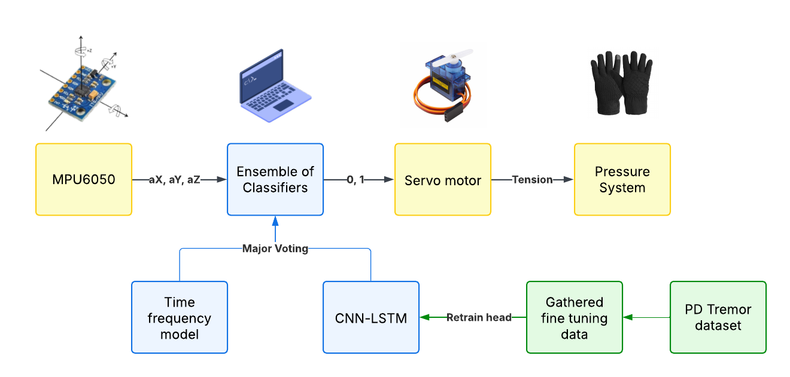
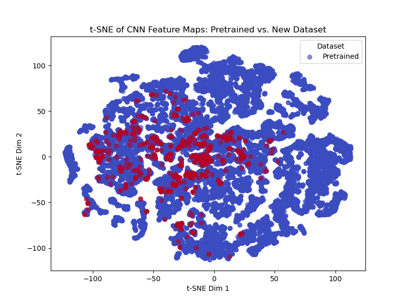
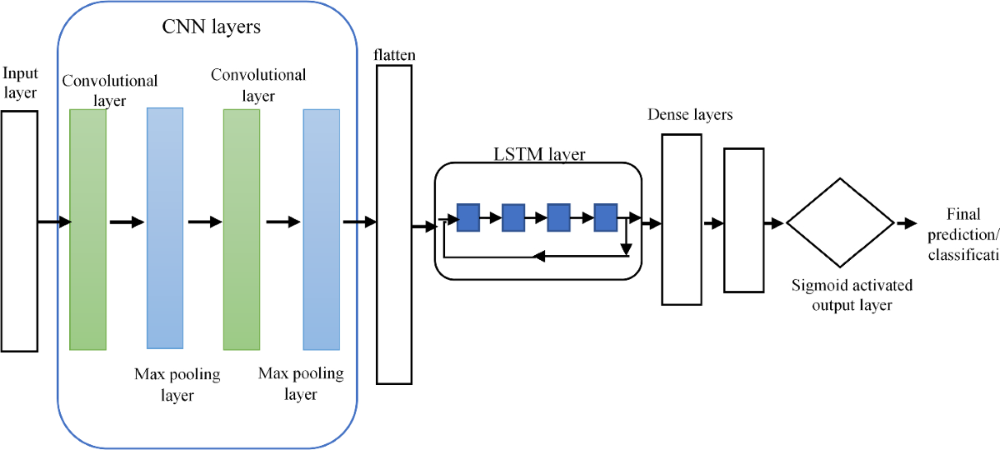
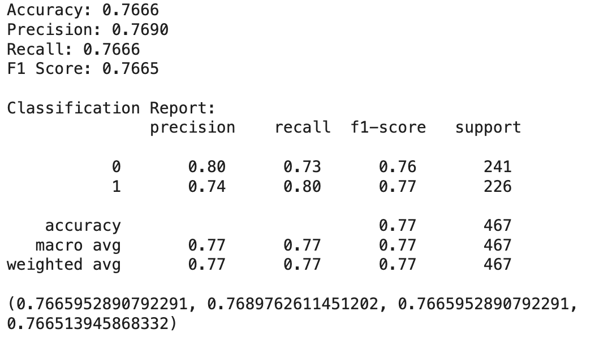

> Built an end-to-end wearable prototype to stabilize nervousness-induced hand tremors using MPU6050 kinematics and servo-controlled string tension. The system uses a CNN-LSTM architecture with few-shot transfer learning (fine-tuned on Parkinson's data) achieving 78% tremor detection accuracy. Ensembled the neural network with sliding window time-frequency analysis to reduce false positives. Awarded **Best Prototype** and placed **Top 3** at University of Toronto's NeuroHack2025.
> 
> **Github:** [https://github.com/supreme-gg-gg/NeuroSteady](https://github.com/supreme-gg-gg/NeuroSteady)
> 
> **Link to career interests**: This project gave me hands-on experience building ML-driven medical devices under extreme resource constraints, which is directly applicable to my bioengineering career goals. The transfer learning approach I developed here is now informing my work on NeuroTech UofT's stroke rehabilitation exoskeleton, where we're adapting gait datasets to personalized patient motion patterns.

---

## Problem

At NeuroHack2025 (48-hour hackathon), we were tasked with improving surgical environment safety. We chose to tackle nervousness-induced hand tremors in surgeons. Looking back, there are bigger OR safety problems to solve. But the 48-hour constraint forced us to scope aggressively, and I'm proud we built a fully functional prototype that won Best Prototype and placed Top 3 overall.

The technical challenge: detect tremors in real-time with limited labeled data, then stabilize mechanically using only an Arduino starter kit.

> This project taught me to work within severe hardware and time constraints while maintaining system performance, which is exactly the skill set needed for rapid prototyping in medical device development where regulatory timelines demand quick iteration cycles.

---

## Method

We adapted our design process for the hackathon format, prioritizing rapid prototyping over conceptual exploration. Two core specs: minimize cost (we had $0 budget beyond the starter kit) and ensure biocompatibility with surgical gloves. Split the system into three subsystems: data acquisition, tremor detection, and tremor stabilization.

### Data Acquisition

Used an **MPU6050** 6-axis accelerometer/gyroscope mounted on the back of the hand in a wearable glove. Chose this over the MPU9250 (used in our training dataset) due to Arduino kit limitations. Sampled at 100Hz to capture tremor frequency range (3-12 Hz for Parkinsonian tremors, we assumed similar for nervousness tremors).

We mirrored the [Hand Tremor Dataset](https://www.kaggle.com/datasets/aaryapandya/hand-tremor-dataset-collected-using-mpu9250-sensor) collection protocol as closely as possible to minimize domain shift in transfer learning.

### Tremor Detection

**Dataset Selection for Transfer Learning**

We used a Parkinson's disease tremor dataset because it was the only publicly available accelerometer tremor data we could find in 48 hours. Risky choice: the MPU9250 vs MPU6050 sensor difference and pathological tremors vs nervousness tremors might have different signatures.

To validate this approach, we quickly collected a custom dataset (20 minutes of simulated tremors from our 4-person team). Using **t-distributed Stochastic Neighbor Embedding (t-SNE)** to visualize the high-dimensional accelerometer data, we confirmed the source domain (Parkinson's) and target domain (our simulated tremors) clustered reasonably close.

Not perfect, but good enough for a hackathon. In production, we'd need actual surgical tremor data.

**Model Architecture: CNN-LSTM with Frozen Layers**

Chose a **1D Convolutional Neural Network** stacked with **Long Short-Term Memory** layers for two reasons:

1. CNNs extract local features from time series (tremor frequency patterns)
2. LSTMs capture temporal dependencies (tremor onset/offset dynamics)

We trained the full CNN-LSTM on the Parkinson's dataset (85% accuracy), then froze the CNN-LSTM layers and only fine-tuned the final feed-forward layers on our custom dataset. This freeze decision was driven by two factors:

- Feature maps from CNN-LSTM layers overlapped significantly between domains (visualized using activation clustering)
- Our custom dataset was tiny (20 minutes) compared to Parkinson's dataset (several hours)

Final accuracy on our test set: **78%** in 50 epochs. The 7% drop from 85% is expected given domain shift. We didn't have time for data augmentation or explicit feature engineering (literature shows hand-crafted frequency domain features can push this to 85-90%).

**Ensemble with Signal Processing**

The CNN-LSTM alone was too sensitive to transient motion artifacts (scratching nose, adjusting mask). So we ensembled it with **sliding window time-frequency analysis** using a simple majority voting system. Run both methods on 2-second windows, only trigger stabilization if both agree.

Traditional signal processing (FFT-based frequency analysis) is robust but not sensitive enough alone. The neural network is sensitive but generates false positives. Ensemble balances both. In 48 hours, this was the fastest way to improve precision without retraining.

> Building this ensemble taught me that production ML systems rarely rely on neural networks alone. Hybrid approaches combining classical signal processing with modern ML often outperform either method individually, especially when dealing with noisy sensor data in medical applications.

### Tremor Stabilization

Highly constrained by the Arduino starter kit. Model inference had to run on a laptop (no TinyML time), so the device stayed tethered within USB cable range.

We stabilized **1 degree of freedom**: up/down wrist motion. This axis causes the most surgical damage (scalpel depth control). The mechanism: wearable glove connected via strings to servo motors mounted on a forearm sleeve. When tremor detected (majority vote above threshold), servos pull strings taut, putting the forearm-hand system in tension and dampening motion. Once tremor stops, servos return to neutral, slackening strings.

Tested on ourselves (no IRB, just hackathon demo). Subjectively reduced visible shaking, but we didn't have time for quantitative validation with IMU measurements during stabilization.

> This mechanical design experience reinforced that hardware constraints often dominate system architecture in medical devices. The tether limitation would be unacceptable clinically, but for a proof-of-concept under extreme time pressure, we made the right tradeoff to demonstrate feasibility.

---
## Solution evaluation

**Strengths:**

- Transfer learning validated faster than expected (t-SNE analysis took 30 minutes)
- Ensemble approach dramatically reduced false positives without retraining
- Mechanical stabilization was simple enough to prototype in 6 hours

**Limitations:**

- Initial attempt at 2D CNN on spectrogram images failed (overfitting on tiny dataset, scrapped after 4 hours)
- Servo response time (200ms) introduced latency; piezoelectric actuators would be faster but weren't in the kit
- Single DOF stabilization meant tremors in other axes weren't addressed
- No clinical validation; simulated tremors may not match real surgical nervousness

If time was not a constraint, I'd prioritize collecting real surgical tremor data first, even if it meant delaying model development.

---

## Future Work

To make this clinically viable:

- [ ] **Model improvements**: Explicit feature engineering using wavelet transforms and spectral analysis (shown in literature to improve Parkinson's tremor detection to 85-90%). Train on real surgical data, not simulated tremors. Implement 10-fold cross-validation for robust accuracy estimates.

- [ ] **Hardware migration**: Port model to ESP32 or similar microcontroller using **TinyML** (TensorFlow Lite Micro) to eliminate laptop tether. Design custom Flex PCB and 3D-printed housing for integration with surgical gloves.

- [ ] **Multi-DOF stabilization**: Replace servo-string mechanism with **piezoelectric actuators** embedded in smart fabric. This enables stabilization along multiple axes simultaneously and reduces response latency to <50ms.

- [ ] **Clinical validation**: Partner with surgical residents to collect real nervousness tremor data during simulated procedures. Measure stabilization effectiveness quantitatively using IMU during actuation.

> These extensions matter because they address the gap between hackathon prototype and FDA-clearable medical device. Understanding this gap, especially the validation and safety requirements, is critical for my bioengineering career where I want to work on assistive technologies that actually reach patients.

---

## Teamwork and My Role

**My role: ML Engineer & System Integrator**

- **Transfer learning pipeline**: I led the CNN-LSTM development. Analyzed the Parkinson's dataset structure, implemented the model in PyTorch, ran the t-SNE validation, and made the decision to freeze layers based on feature map analysis.
- **Data collection**: Helped design the custom dataset collection protocol. We all took turns simulating tremors (shaking hands intentionally) while wearing the MPU6050 to build the fine-tuning dataset.
- **Wearable design and integration**: I designed the wearable system containing the MPU6050 and servos. Coordinated with the teammate who built the servo system to define the threshold and timing in the ensemble system for triggering stabilization.

**Collaboration dynamics**: The biggest challenge was coordinating mechanical and ML subsystems when we were building them in parallel with no formal interface spec. We iterated the trigger threshold 5-6 times during final integration because the servo response was slower and more inconsistent than expected.

> Working under this time pressure taught me to communicate design decisions quickly and adapt to changing constraints. In bioengineering, where mechanical, electrical, and software subsystems must integrate seamlessly, this rapid iteration skill is essential.

---

## Takeaways

Built a working tremor stabilization system in 48 hours that won Best Prototype at a university hackathon. The transfer learning approach worked despite domain shift concerns, and the hybrid ML/signal-processing ensemble was the right call for the time constraint.

Three things I learned:

1. Validate transfer learning viability early with dimensionality reduction (t-SNE saved us from wasting time on incompatible datasets)
2. Ensemble methods can rescue imperfect ML models faster than retraining, especially under time pressure
3. Hardware constraints (Arduino kit, tether to laptop) force creative mechanical solutions

>This project built my confidence in rapid ML prototyping for medical applications and gave me practical experience with the sensor-model-actuator pipeline that's central to assistive robotics. The skills I developed here directly enable my current work on NeuroTech's stroke rehabilitation exoskeleton, where we're solving similar problems with more time and better hardware.