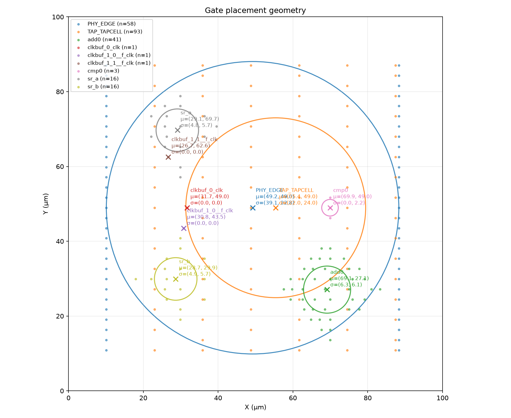
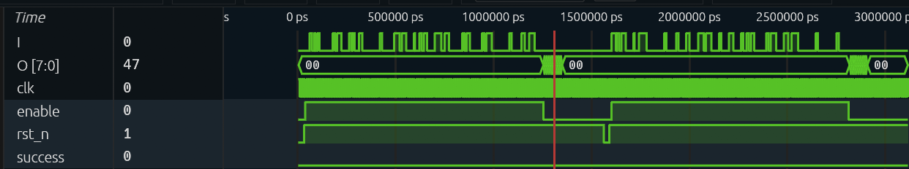

This post is about an ASIC reverse engineering puzzle Jane Street published. You get a GDS file, the layout file used for fabrication, and you need to extract the string the chip prints by entering the right input. As a mechanical engineering student this was a challenging yet very engaging introduction to ASICs. This post covers the details of my reverse-engineering process and what they taught me.

> **TL;DR: if you are only interested in how I solved it**
>
> I used the warmup section to formulate my method for tackling the puzzle since it was my first time dealing with ASICs. Having the source Verilog, the netlists and DEF files, it helped me verify the reverse engineering system I was building and ensure it generalized to the puzzle.
>
> I started by converting the GDS to netlists to obtain an analyzable format of the chip using KLayout's Python API (`LayoutToNetlist`). For verification, I converted both the netlist extracted from the warmup GDS and the given one into graphs using NetworkX, checking for isomorphism. Once the script passed the isomorphism tests I used it on the puzzle GDS to convert it to a netlist.
>
> Eventually I began hitting roadblocks in this warmup-guided reverse engineering system development (TL;DR I was running out of time and patience; the long version is below). I tried looking at different sources for more information: the answer form, the hints in the puzzle PNG and VCD. The form asked for a string as the final answer, which the GitHub README said I would get from the output generator block after simulation. So I knew to be on the lookout for a string in the VCD `O[7:0]` output. After tabulating the output values I realized they were ASCII for characters. Unsuccessful inputs that left `success` low returned the string `TRY AGAIN`, one character per clock. Looking at the VCD carefully also helped me understand the input protocol: the `enable` input was high for 121 clock cycles during which the key input `I` was fed, one bit per cycle, which told me the correct input was a 121-bit serial key.
>
> I was confident in my GDS to netlist system though, so I decided to try using the extracted puzzle netlist to create a gate-level Python simulation. The simulator takes each cell's boolean function from the sky130 naming grammar documentation. It separates the cells into flip-flops and gates, then sorts the gates into evaluation order. One clock cycle involves evaluating every gate from the flip-flops' stored bits and the inputs, which fills every net including `O` and `success`. The flip-flops are then updated from their D inputs (or reset if the reset pin is low). To verify the simulator I replayed the example VCD inputs through it. The outputs from the simulator matched the VCD outputs, which proved the simulator, the extracted netlist and the GDS all agreed.
>
> Finding the key was a constraint problem: the inputs had to make `success` 1. I solved it using Z3. I reused the simulator to build a boolean formula of the chip: I ran it through the VCD's protocol I identified earlier with the 121 input bits left as unknowns. Z3 doesn't brute force all 2^121 inputs. It deduces the bits forced by the "success must be 1" requirement, guesses different eligible inputs, and rules out every input that leads to a contradiction. When the correct input was found I confirmed uniqueness by adding another constraint that the input cannot be the correct key. Uniqueness was proven when re-solving returned unsat.
>
> The string output from the correct input was `(* TWO STARS *)`, printed as 7-bit ASCII on `O[7:0]`, one character per clock.

## Exploring the language

I began by acquainting myself with Verilog syntax and the jargon I came across in the warmup section. The first file, `00_source.v`, is the human-written Verilog source. It took a while to see the structure: a main module that calls other modules as instances to carry out an intended function, each instance with inputs and outputs, and the outputs of one flowing into the inputs of the next. Two shift registers `sr_a` and `sr_b` take serial input, an adder `add0` adds their contents, and a comparator `cmp0` checks the result against a target.

Then I tried to track what changes occurred in files in the RTL to GDS pipeline. Converting source Verilog to netlist flattens the module encapsulation: the netlist `01_netlist.v` is one flat list of standard cell instances and the wires between them, with the module hierarchy gone. `02_netlist_with_power_rails.v` and the DEF file `03_post_place_and_route.def` add power + ground pins and x/y coordinates + orientations to every cell respectively. `04_final.gds` is the layout itself: the polygons on each mask layer, with the names gone, ready for fabrication.

## Trying to understand cell placement

I tried to understand the patterns in the placement of cells and what created them in the warmup files. My hypothesis was that cells belonging to the same instance would be placed close together to reduce latency: the further apart the gates of a function, the longer the wires and the longer the function takes. I wrote a script to group the DEF cells by the instance prefix in their names and compute a centroid and spread for each group:

```text
PHY_EDGE:          n=58, centroid=(49.220, 48.960) um, std=(39.100, 22.757) um
TAP_TAPCELL:       n=93, centroid=(55.408, 48.960) um, std=(21.996, 24.042) um
add0:              n=41, centroid=(69.135, 27.067) um, std=( 6.297,  6.066) um
clkbuf_0_clk:      n=1,  centroid=(31.740, 48.960) um
clkbuf_1_0__f_clk: n=1,  centroid=(30.820, 43.520) um
clkbuf_1_1__f_clk: n=1,  centroid=(26.680, 62.560) um
cmp0:              n=3,  centroid=(69.920, 48.960) um, std=( 0.000,  2.221) um
sr_a:              n=16, centroid=(29.095, 69.700) um, std=( 4.787,  5.679) um
sr_b:              n=16, centroid=(28.664, 29.920) um, std=( 4.867,  5.689) um
```



So the instances are indeed clustered. The two shift registers sit on one vertical, the adder and comparator on another, the clock buffers spread between the shift registers, and the tap and edge cells form a fixed grid spanning the whole chip. I also realized the clusters aligned vertically and decided that was not necessarily logic-relevant; it could be a product of some optimization.

This exploration indicated that spatial proximity is evidence of shared electrical context. E.g. `sr_a` and `sr_b` are close because they both take input from the same edge of the chip.

## Deciding on an approach

While building this understanding I was weighing a few approaches:

1. Try to replicate ASIC starting from Verilog using hints from its structure 
2. Try to conceptualize conversion cycle in terms of transformations to reverse them
3. Try ML recognition of different basic structures to reverse engineer

The second approach seemed the most tractable for me so I tried exploring in that direction. I also spent a while thinking about the problem through linear algebraic and information theoretic lenses. Neither turned out to be a very useful perspective, so I formulated the following execution plan:

1. Write script converting GDS to netlist for the warmup files, iterating on it and preparing it for the puzzle using the functional information as well as the netlist I already have for the warmup.
2. Try to use the extracted netlist to understand chip function using clues for the warmup to design an approach for the puzzle: how best to organize the netlist information using a script to facilitate reverse engineering.
3. Reconstruct chip function when the only thing I can do is manual analysis, see if automation is worth it. I see it looking like minesweeper on steroids.
4. Edit: use the information about the chip you gain from structural reverse engineering to design simulation of output to get the string that the puzzle asks for. Be discretional about where you dedicate reverse engineering effort, I'm not sure how the simulation will work just yet but i think the structural reverse engineering should give insights into that

P.S. I'm not quite sure how this approach would have turned out, I really only completed steps 1 and 4. I hope verbatim extracts like these from my notes convey how my understanding evolved over the course of this project.

Before starting I looked at the puzzle's hints for anything that could further refine and optimize this approach. I noticed that the example VCD has inputs `I`, `clk`, `rst_n` and `enable`, an 8-bit output `O` and a `success` wire, and the README says `success` goes high for the correct input. The smallest interval over which inputs changed looked like 4000 ps and the whole dump spans 3120000 ps, so I estimated something like 780 clock cycles and, since `I` is a single-bit wire, roughly 780 unknown bits. Brute force made no sense: 2^780 permutations for what the description implied was a single correct input. (I first wrote 2^(4×780) before realising `clk`, `rst_n` and `enable` are not unknowns.) This was only a Fermi estimate to size the problem, and it turned out to be wrong, as you will see, but the conclusion held.

The shape of the I/O interface: a one-bit input per clock cycle and a `success` output suggested a shift register feeding some kind of comparator against a stored answer. The PNG hint pins down the port placement and says the region labelled "output generator" is safe to ignore during initial reverse engineering but has to be simulated to get the final answer. At the time I was really not sure what this simulation meant.


## GDS to netlist

I initially planned to reconstruct the netlist using a custom script with geometric overlap checks, with an overlap tolerance for shapes that only just touch. KLayout's `LayoutToNetlist` made it much easier. It traces electrical connectivity through the drawn shapes: overlapping metal on one layer is one net, and a via joins the net on one layer to the net on the next.

The cells are treated as black boxes. The chip uses the open sky130 standard cell library, and each cell keeps its library name in the GDS as a hierarchy label. Those names follow a grammar: `a21oi`, for example, is an AND-OR-invert with a 2-input AND and a 1-input OR feeding a NOR. I generated a cell library from that grammar and the pin labels in the GDS, and the script looks up each cell's name in it to find its pins.

The biggest asset of using the warmup to develop the reverse engineering system was the availability of ground truth files earlier in the RTL to GDS pipeline. This allowed me to compare the given netlist with the extracted one. I converted both the extracted netlist and the given `01_netlist.v` into graphs in NetworkX, cell instances as nodes labelled by cell type and wires as edges labelled by pin, dropped the power nets, and checked for graph isomorphism. This method of verification is ideal because instance names cannot be derived from the GDS, limiting any text-based comparison. After pruning the tap and decap filler cells the warmup netlist has 79 logic cells (16 flip-flops, 16 muxes, 44 gates, 3 clock buffers). The extraction had exactly the same 79 with the same types, the graphs had the same 163 nodes and 285 edges, and the isomorphism check found a full match.

I was confident in the extracted puzzle netlist since the GDS to netlist pipeline is deterministic and objective and has a reliable verification source and method. So I used the same script for puzzle netlist extraction. The puzzle netlist has 728 logic cells across 69 cell types: 92 flip-flops and 636 gates, with a single clock tree and no combinational loops.

## Major roadblocks

Step two of the plan was to organize the netlist for reverse engineering. I tried a bunch of methods to cluster the extracted cells into instance-shaped groups, using the warmup's instance names as ground truth to score against. After a handful of experiments the clustering looked like this:

| Method | Clusters | Misassigned out of 79 |
| --- | --- | --- |
| Louvain, unweighted | 7 | ~19 |
| Bit-slice seed and propagate | 8 | 33 |
| Spectral clustering, k=6 | 6 | 16 |
| Pin-weighted Louvain | 6 | 34 |
| Fluid communities, k=2 | 2 | not scored |

Sixteen out of 79 was the best, and I could not tell whether even that would generalize to the puzzle. Every parameter had been chosen while looking at scores against the warmup answer, and the puzzle has no answer to score against, so a method tuned to the small sized warmup files would just produce a confident wrong clustering in the larger puzzle with no way to verify. The visualisation system I started for the netlist did not get far either; it wasn't facilitating reverse engineering at all so I abandoned it halfway.

I realised manual reverse engineering was impossible with the time and experience I had, so I went looking in the repo for any information I might have missed.

## Reading the hints properly

Two sources gave me the information I needed to make progress: the answer form and the example VCD.

The form asks for a string extracted from the chip. The README says this string comes out of the output generator after simulation. So the thing to look for is text on `O[7:0]`.

I opened the VCD in Surfer, and then tabulated `O` at every rising clock edge in a script. The values were ASCII. One character comes out per clock. The example contains two attempts, not one long one, which is where my 780-bit estimate had gone wrong. Each attempt ends with the chip printing `TRY AGAIN` and `success` staying low.



The VCD also fixed the input protocol. Hold `rst_n` low for a few cycles and release it. Hold `enable` high for exactly 121 rising clock edges, presenting one bit per edge on `I`. Drop `enable`. So the key is to find the 121 bits that make `success` go high, then read the string that follows.

Here I started to understand what the simulator would look like: it would be a software equivalent of the chip designed using the netlist I extracted. It would also collect inputs and give outputs conforming to the VCD protocol. The example VCD gave me a free test for this simulator: a correct simulator driven with the same inputs has to print `TRY AGAIN` at the same clock edges.

## The simulator

The simulator is a Python equivalent of the extracted netlist. Each cell's boolean function comes from the sky130 naming grammar, the same grammar that generated the netlist extractor's cell library (which needed to be expanded to include cells that weren't in the warmup).

The model separates the 728 cells into flip-flops and gates and sorts the gates into evaluation order, so every gate is evaluated after the gates it receives input from. One clock cycle is: evaluate every gate from the current flip-flop contents and the current inputs, which fills every net including `O` and `success`; then update every flip-flop from its D input, or reset it if its reset pin is low.

Then the check: replay the VCD's inputs through the model and compare `O` and `success` at each of its 312 rising clock edges.

The first run had 20 mismatches. The model printed T, R, Y, space, A, G, A, I, N, exactly right, one clock edge late. This was because the VCD records each value at the timestamp of the clock edge, meaning after the flip-flops have updated, and I was comparing the value from before the edge.

The second run was worse: 26 mismatches, and the model printed only R, space, G, I during the second attempt and nothing at all during the first. Moving the flip-flop update before the comparison had left the original update call at the bottom of the loop, so the model was running two clock cycles per VCD edge. The input was shifted in twice per bit and the message came out at half rate.

With that removed: 312 edges, 0 mismatches, both `TRY AGAIN` bursts at the right edges. The model reproduced the example waveform, which means the GDS, the extracted netlist and the simulator are consistent with one another.

Even after this success, I found that the puzzle netlist contained a single net with no driver: nothing sets its value, yet it feeds two AND-OR-invert cells in the output generator. I never found out why in the geometry. Instead I tried to see its effect on the output by running everything twice, once with the net forced to 0 and once forced to 1. The VCD replay came out identical both ways, and so did the final answer later. Since the net has no effect on the output, I left it unresolved.

With a working model I could also try inputs. All zeros for 121 cycles prints `EMPTY SKY`. All ones prints `BIG BANG`. Everything else I tried printed `TRY AGAIN`.

## Finding the key

Finding the key is a constraint problem: 121 unknown bits, and the requirement that `success` be 1 afterwards. I used Z3, a solver for exactly this kind of problem.

I did not have to write anything new to describe the chip to Z3. The simulator already evaluates every gate from its inputs, so I ran it through the VCD's protocol (reset, 121 enable cycles, 8 idle cycles) with the 121 input bits left as unknowns instead of concrete 0s and 1s. The value of `success` at the end is a boolean formula over those 121 unknowns, describing the whole chip across all 129 cycles. 

Z3 does not try all 2^121 inputs. It deduces the bits that are forced by the requirement that `success` must be 1, guesses an input within this constraint, and whenever a guess leads to a contradiction it rules out every input that shares that contradiction.

When I found a successful input, I checked for uniqueness by adding a constraint that the input must not equal the one I just found and solved again. Z3 returned unsat: no other 121-bit input works under this protocol, so the key is unique. Then I fed the key through the ordinary concrete simulator. `success` goes high on the edge after the 121st enable cycle and the chip prints, one character per clock:

```text
(* TWO STARS *)
```

The key itself is:

```text
0000000101010000100000000000010101010000000000001010000001000001000000100000101000010000000100000010000010010001010000000
```

## What I learnt

The general approach that helped me most is leveraging the information I had to create a general problem solving system, which I could use to explore the unknown. The GDS to netlist converter was checked against the warmup netlist. The simulator was checked against the puzzle's own VCD. The solver's answer was checked by replaying it through the simulator. The loose end I could not close, the undriven net, I tested both ways. 

That approach gives a steady start, but it has a limit. When I got stuck on netlist clustering and visualisation, I made faster progress by experimenting with the incomplete tools I already had than by trying to finish an end-to-end system. The structural approach, recovering module boundaries and reading the design block by block, turned out to be unnecessary for this puzzle. Once I figured out how to simulate and solve the extracted netlist using the given VCD and its I/O protocol, I could skip the logic reverse engineering.