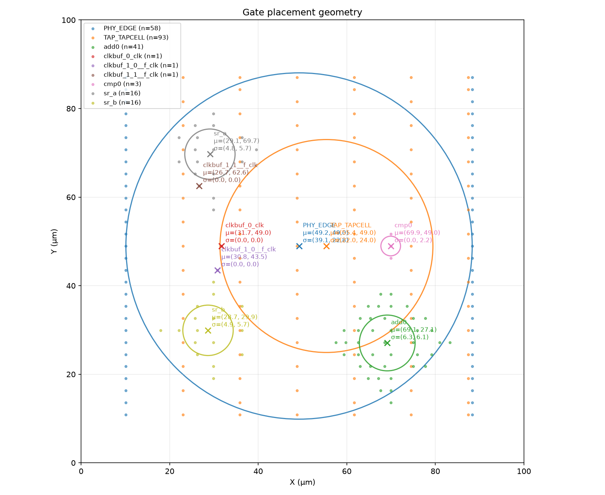
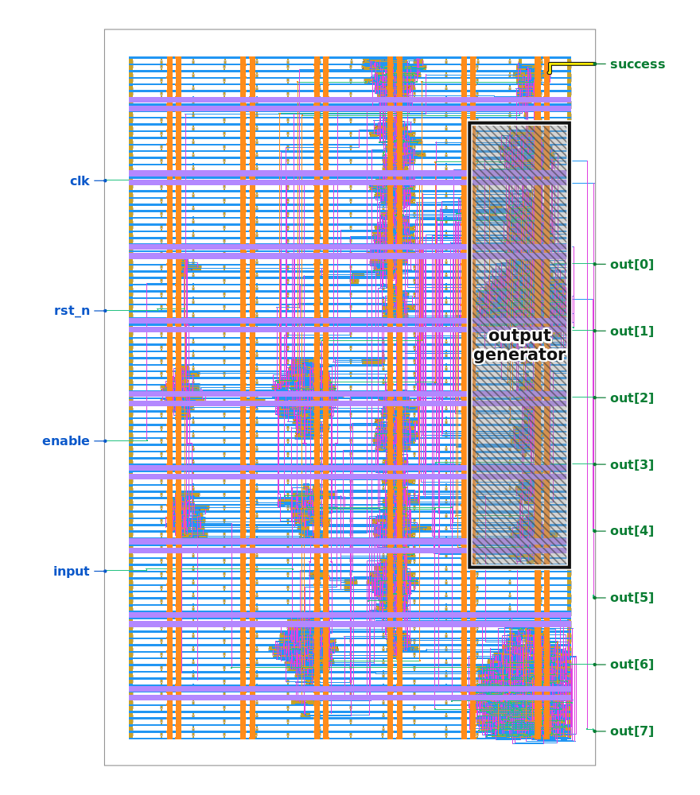
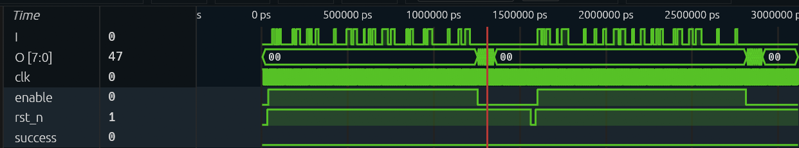

[Jane Street](https://blog.janestreet.com/can-you-reverse-engineer-an-asic/published) just a chip's layout. You had to find the string it prints when you enter the right input.

I am a mechanical engineering student and this was my first ASIC. I had worked with 3D printing file formats before and thought that would help with the layout file. It did not, but it was enough of a push to start.

<div style="margin:0 auto 1rem;max-width:640px">
<video controls autoplay muted loop playsinline style="display:block;width:100%;border-radius:6px" src="/EngineeringPortfolio/docs/warmup_gds_3d.mp4" aria-label="3D render of the warmup chip GDS, slowly orbiting"></video>
</div>

*The warmup chip's GDS in 3D. Standard cells along the bottom, metal wiring stacked above them, wide power straps on top. The puzzle chip is the same thing with a lot more cells.*

This post is the solve. [Part 2](/EngineeringPortfolio/projects/asicpuzzle2026-starbattle) is figuring out the chip's function.

## The puzzle

An ASIC is a chip built for one task. It is made in stages, and each step takes away hierarchical structure moving towards a manufacturable layout.

| Stage           | What it is                                                                                                     | What is lost     |
| --------------- | -------------------------------------------------------------------------------------------------------------- | ---------------- |
| Verilog source  | Readable code with named modules and signals.                                                                  |                  |
| Netlist         | The code mapped onto standard cells: NAND, NOR, XOR, muxes, and flip-flops. A flat list of cells and wires.    | Module hierarchy |
| Place and route | Every cell gets coordinates and orientations on the die. Wires become metal on stacked layers, joined by vias. |                  |
| GDS             | This is physical layout used by fabs for manufacturing.                                                        | All names        |

The GDS is what the puzzle gives you. Everything the chip does is in there, and nothing is labelled.

Also in the repo:

- A recorded waveform, a VCD file, of sample inputs and outputs over a few hundred clock cycles.
- A die image with one region marked "output generator".
- A warmup: a small adder at every stage, Verilog through GDS. The only place to check your tools against a known answer.
- Hints. The layout is arranged to suggest function. The output generator can be ignored while reverse engineering but must be simulated for the answer. Toggle `rst_n` before each attempt.

The chip has a one-bit input `I`, a clock, a reset, an `enable`, an 8-bit output `O` and a one-bit `success`. Turn the polygons back into a netlist, work out what the chip checks, find the input that makes `success` go high, read the string on `O`.

The cells are sky130, SkyWater's open 130 nm library. Every cell's design and name are public. 
## TL;DR

| Step                                       | Checked against                                | Result                       |
| ------------------------------------------ | ---------------------------------------------- | ---------------------------- |
| Polygons to netlist, with KLayout          | The warmup's given netlist, by graph isomorphism | Identical wiring           |
| Netlist to a Python simulator              | The puzzle's own waveform                      | 312 clock edges, 0 mismatches |
| Simulator to Z3, 121 input bits unknown    | Excluding the key and solving again            | Unsat. The key is unique     |
| Key back through the simulator             |                                                | `(* TWO STARS *)`            |

## Reading the warmup

The warmup's Verilog took a while to read. A main module instantiates others, and the outputs of one feed the inputs of the next. Two shift registers `sr_a` and `sr_b` take serial input, an adder `add0` adds their contents, and a comparator `cmp0` checks the sum against 496.

The five files are the five stages of the table above: `00_source.v`, `01_netlist.v`, `02_netlist_with_power_rails.v`, `03_post_place_and_route.def`, `04_final.gds`.

## Placement is evidence

Do cells from the same module sit together? I grouped the warmup's placed cells by instance name and computed a centroid and spread for each:

```text
add0:   n=41, centroid=(69.1, 27.1) um, std=(6.3, 6.1) um
cmp0:   n=3,  centroid=(69.9, 49.0) um, std=(0.0, 2.2) um
sr_a:   n=16, centroid=(29.1, 69.7) um, std=(4.8, 5.7) um
sr_b:   n=16, centroid=(28.7, 29.9) um, std=(4.9, 5.7) um
```



Same module cells were indeed clustered. The two shift registers share one vertical, the adder and comparator another, the clock buffers sit between the shift registers, and the tap and edge cells form a fixed grid across the chip. Cells that are close share electrical context: `sr_a` and `sr_b` both take input from the same edge.

## Picking an approach

Three options:

1. Rebuild the Verilog from structural hints.
2. Treat the creation pipeline as transformations and reverse them one by one.
3. Train a model to recognise basic structures.

I picked 2. I also spent a while looking at the problem through linear algebra and information theory. Neither really fit or was a helpful way of thinking.

Before writing code I went through the hints for anything that would size the problem.

The VCD's input seemed to change every 4000 ps and the dump spans 3,120,000 ps. About 780 clock cycles, and since `I` is one bit, about 780 unknown bits. (I first wrote $2^{4 \times 780}$ before realising `clk`, `rst_n` and `enable` are not unknowns.) The estimate turned out six times too high, but the conclusion held: brute force was out.

One bit per clock in and a `success` out looked like a shift register feeding a comparator against a stored answer. I did not test that guess until after the solve. It was wrong. There is no stored answer in this chip.

The die image marks an "output generator", and the repo says it can be simulated instead of reverse engineered. I did not understand what that meant yet. It turned out to be the approach that solved the puzzle.



My plan, from my notes at the time:

> 1. Write a GDS to netlist script. Develop it on the warmup, where I already have the true netlist to check against.
> 2. Organize the extracted netlist so a human can reverse engineer it.
> 3. Reconstruct chip function by hand. Minesweeper on steroids.
> 4. Use what I learn to simulate the output and get the string. Not sure what the simulation looks like yet.

I only ever completed steps 1 and 4.

## Polygons back into wires

I planned to write my own overlap checker. KLayout's `LayoutToNetlist` made that unnecessary. It traces connectivity through the drawn shapes: overlapping metal on one layer is one net, and a via joins a net on one layer to the next.

Cells are black boxes. Each keeps its sky130 name in the GDS as a hierarchy label, and the names are a grammar:

```text
a 2 1 o i
│ │ │ │ └─ i:  output inverted
│ │ │ └─── o:  ...then OR'd together
│ │ └───── 1:  ...with one more input
│ └─────── 2:  ...of 2 inputs
└───────── a:  first stage is an AND
           => AND-OR-invert, a21oi
```

I generated a cell library from that grammar plus the pin labels in the GDS. The extractor looks each cell up by name to find its pins.

Instance names do not survive into a GDS, so comparing my netlist to the warmup's by text is useless. Compare the shape instead. Both netlists become graphs: a node per cell labelled by type, a node per net, and an edge for every pin labelled by pin name, with power nets dropped. Then ask whether the two graphs are isomorphic: is there a relabelling of one that makes it identical to the other?

Here is the comparator, `cmp0`, in both. It checks the 9-bit sum against 496, which in binary is five ones then four zeros, so it is three AND gates:

<svg viewBox="0 0 660 236" width="660" height="236" xmlns="http://www.w3.org/2000/svg" role="img" aria-label="The warmup comparator as two graphs: the given netlist with names on the left, the netlist extracted from the GDS without names on the right, same three AND cells and same wiring" style="display:block;margin:0 auto 1rem;max-width:100%;height:auto">
<text x="160" y="14" text-anchor="middle" style="font-family:var(--font-sans);font-size:11px;font-weight:600;fill:var(--sl-color-text)">Given netlist</text>
<line x1="68" y1="28" x2="130" y2="34" style="stroke:var(--sl-color-text);stroke-width:1;opacity:0.7"/>
<line x1="68" y1="52" x2="130" y2="48" style="stroke:var(--sl-color-text);stroke-width:1;opacity:0.7"/>
<line x1="68" y1="76" x2="130" y2="62" style="stroke:var(--sl-color-text);stroke-width:1;opacity:0.7"/>
<line x1="68" y1="100" x2="130" y2="112" style="stroke:var(--sl-color-text);stroke-width:1;opacity:0.7"/>
<line x1="68" y1="124" x2="130" y2="130" style="stroke:var(--sl-color-text);stroke-width:1;opacity:0.7"/>
<line x1="68" y1="148" x2="130" y2="148" style="stroke:var(--sl-color-text);stroke-width:1;opacity:0.7"/>
<line x1="68" y1="172" x2="130" y2="166" style="stroke:var(--sl-color-text);stroke-width:1;opacity:0.7"/>
<path d="M194,48 L212,48 L212,132 L230,132" style="fill:none;stroke:var(--sl-color-text);stroke-width:1;opacity:0.7"/>
<path d="M194,136 L212,136 L212,150 L230,150" style="fill:none;stroke:var(--sl-color-text);stroke-width:1;opacity:0.7"/>
<line x1="68" y1="196" x2="230" y2="168" style="stroke:var(--sl-color-text);stroke-width:1;opacity:0.7"/>
<line x1="68" y1="220" x2="230" y2="186" style="stroke:var(--sl-color-text);stroke-width:1;opacity:0.7"/>
<rect x="130" y="20" width="64" height="56" rx="4" style="fill:var(--sl-color-gray-6);stroke:var(--sl-color-text);stroke-width:1"/>
<text x="162.0" y="48.0" text-anchor="middle" style="font-family:var(--font-mono);font-size:9px;fill:var(--sl-color-text)">and3_2</text>
<text x="162.0" y="60.0" text-anchor="middle" style="font-family:var(--font-mono);font-size:8px;fill:var(--sl-color-gray-3)">cmp0/_2_</text>
<text x="133" y="37" style="font-family:var(--font-mono);font-size:7px;fill:var(--sl-color-gray-3)">C</text>
<text x="133" y="51" style="font-family:var(--font-mono);font-size:7px;fill:var(--sl-color-gray-3)">B</text>
<text x="133" y="65" style="font-family:var(--font-mono);font-size:7px;fill:var(--sl-color-gray-3)">A</text>
<line x1="194" y1="48.0" x2="206" y2="48.0" style="stroke:var(--sl-color-text);stroke-width:1;opacity:0.7"/>
<rect x="130" y="100" width="64" height="72" rx="4" style="fill:var(--sl-color-gray-6);stroke:var(--sl-color-text);stroke-width:1"/>
<text x="162.0" y="136.0" text-anchor="middle" style="font-family:var(--font-mono);font-size:9px;fill:var(--sl-color-text)">and4bb_2</text>
<text x="162.0" y="148.0" text-anchor="middle" style="font-family:var(--font-mono);font-size:8px;fill:var(--sl-color-gray-3)">cmp0/_3_</text>
<text x="133" y="115" style="font-family:var(--font-mono);font-size:7px;fill:var(--sl-color-gray-3)">D</text>
<text x="133" y="133" style="font-family:var(--font-mono);font-size:7px;fill:var(--sl-color-gray-3)">C</text>
<text x="133" y="151" style="font-family:var(--font-mono);font-size:7px;fill:var(--sl-color-gray-3)">A_N</text>
<text x="133" y="169" style="font-family:var(--font-mono);font-size:7px;fill:var(--sl-color-gray-3)">B_N</text>
<line x1="194" y1="136.0" x2="206" y2="136.0" style="stroke:var(--sl-color-text);stroke-width:1;opacity:0.7"/>
<rect x="230" y="120" width="64" height="72" rx="4" style="fill:var(--sl-color-gray-6);stroke:var(--sl-color-text);stroke-width:1"/>
<text x="262.0" y="156.0" text-anchor="middle" style="font-family:var(--font-mono);font-size:9px;fill:var(--sl-color-text)">and4bb_2</text>
<text x="262.0" y="168.0" text-anchor="middle" style="font-family:var(--font-mono);font-size:8px;fill:var(--sl-color-gray-3)">cmp0/_4_</text>
<text x="233" y="135" style="font-family:var(--font-mono);font-size:7px;fill:var(--sl-color-gray-3)">C</text>
<text x="233" y="153" style="font-family:var(--font-mono);font-size:7px;fill:var(--sl-color-gray-3)">D</text>
<text x="233" y="171" style="font-family:var(--font-mono);font-size:7px;fill:var(--sl-color-gray-3)">A_N</text>
<text x="233" y="189" style="font-family:var(--font-mono);font-size:7px;fill:var(--sl-color-gray-3)">B_N</text>
<line x1="294" y1="156.0" x2="306" y2="156.0" style="stroke:var(--sl-color-text);stroke-width:1;opacity:0.7"/>
<circle cx="68" cy="28" r="3" style="fill:var(--sl-color-accent)"/>
<text x="60" y="31" text-anchor="end" style="font-family:var(--font-mono);font-size:9px;fill:var(--sl-color-text)">sum[8]</text>
<circle cx="68" cy="52" r="3" style="fill:var(--sl-color-accent)"/>
<text x="60" y="55" text-anchor="end" style="font-family:var(--font-mono);font-size:9px;fill:var(--sl-color-text)">sum[7]</text>
<circle cx="68" cy="76" r="3" style="fill:var(--sl-color-accent)"/>
<text x="60" y="79" text-anchor="end" style="font-family:var(--font-mono);font-size:9px;fill:var(--sl-color-text)">sum[6]</text>
<circle cx="68" cy="100" r="3" style="fill:var(--sl-color-accent)"/>
<text x="60" y="103" text-anchor="end" style="font-family:var(--font-mono);font-size:9px;fill:var(--sl-color-text)">sum[5]</text>
<circle cx="68" cy="124" r="3" style="fill:var(--sl-color-accent)"/>
<text x="60" y="127" text-anchor="end" style="font-family:var(--font-mono);font-size:9px;fill:var(--sl-color-text)">sum[4]</text>
<circle cx="68" cy="148" r="3" style="fill:var(--sl-color-accent)"/>
<text x="60" y="151" text-anchor="end" style="font-family:var(--font-mono);font-size:9px;fill:var(--sl-color-text)">sum[3]</text>
<circle cx="68" cy="172" r="3" style="fill:var(--sl-color-accent)"/>
<text x="60" y="175" text-anchor="end" style="font-family:var(--font-mono);font-size:9px;fill:var(--sl-color-text)">sum[2]</text>
<circle cx="68" cy="196" r="3" style="fill:var(--sl-color-accent)"/>
<text x="60" y="199" text-anchor="end" style="font-family:var(--font-mono);font-size:9px;fill:var(--sl-color-text)">sum[1]</text>
<circle cx="68" cy="220" r="3" style="fill:var(--sl-color-accent)"/>
<text x="60" y="223" text-anchor="end" style="font-family:var(--font-mono);font-size:9px;fill:var(--sl-color-text)">sum[0]</text>
<circle cx="206" cy="48" r="3" style="fill:var(--sl-color-accent)"/>
<text x="206" y="42" text-anchor="middle" style="font-family:var(--font-mono);font-size:8px;fill:var(--sl-color-gray-3)">_0_</text>
<circle cx="206" cy="136" r="3" style="fill:var(--sl-color-accent)"/>
<text x="206" y="130" text-anchor="middle" style="font-family:var(--font-mono);font-size:8px;fill:var(--sl-color-gray-3)">_1_</text>
<circle cx="306" cy="156" r="3" style="fill:var(--sl-color-accent)"/>
<text x="306" y="148" text-anchor="middle" style="font-family:var(--font-mono);font-size:9px;fill:var(--sl-color-text)">S</text>
<text x="330" y="126" text-anchor="middle" style="font-family:var(--font-sans);font-size:26px;fill:var(--sl-color-text)">≅</text>
<text x="500" y="14" text-anchor="middle" style="font-family:var(--font-sans);font-size:11px;font-weight:600;fill:var(--sl-color-text)">Extracted from GDS</text>
<line x1="408" y1="28" x2="470" y2="34" style="stroke:var(--sl-color-text);stroke-width:1;opacity:0.7"/>
<line x1="408" y1="52" x2="470" y2="48" style="stroke:var(--sl-color-text);stroke-width:1;opacity:0.7"/>
<line x1="408" y1="76" x2="470" y2="62" style="stroke:var(--sl-color-text);stroke-width:1;opacity:0.7"/>
<line x1="408" y1="100" x2="470" y2="112" style="stroke:var(--sl-color-text);stroke-width:1;opacity:0.7"/>
<line x1="408" y1="124" x2="470" y2="130" style="stroke:var(--sl-color-text);stroke-width:1;opacity:0.7"/>
<line x1="408" y1="148" x2="470" y2="148" style="stroke:var(--sl-color-text);stroke-width:1;opacity:0.7"/>
<line x1="408" y1="172" x2="470" y2="166" style="stroke:var(--sl-color-text);stroke-width:1;opacity:0.7"/>
<path d="M534,48 L552,48 L552,132 L570,132" style="fill:none;stroke:var(--sl-color-text);stroke-width:1;opacity:0.7"/>
<path d="M534,136 L552,136 L552,150 L570,150" style="fill:none;stroke:var(--sl-color-text);stroke-width:1;opacity:0.7"/>
<line x1="408" y1="196" x2="570" y2="168" style="stroke:var(--sl-color-text);stroke-width:1;opacity:0.7"/>
<line x1="408" y1="220" x2="570" y2="186" style="stroke:var(--sl-color-text);stroke-width:1;opacity:0.7"/>
<rect x="470" y="20" width="64" height="56" rx="4" style="fill:var(--sl-color-gray-6);stroke:var(--sl-color-text);stroke-width:1"/>
<text x="502.0" y="52.0" text-anchor="middle" style="font-family:var(--font-mono);font-size:9px;fill:var(--sl-color-text)">and3_2</text>
<text x="473" y="37" style="font-family:var(--font-mono);font-size:7px;fill:var(--sl-color-gray-3)">C</text>
<text x="473" y="51" style="font-family:var(--font-mono);font-size:7px;fill:var(--sl-color-gray-3)">B</text>
<text x="473" y="65" style="font-family:var(--font-mono);font-size:7px;fill:var(--sl-color-gray-3)">A</text>
<line x1="534" y1="48.0" x2="546" y2="48.0" style="stroke:var(--sl-color-text);stroke-width:1;opacity:0.7"/>
<rect x="470" y="100" width="64" height="72" rx="4" style="fill:var(--sl-color-gray-6);stroke:var(--sl-color-text);stroke-width:1"/>
<text x="502.0" y="140.0" text-anchor="middle" style="font-family:var(--font-mono);font-size:9px;fill:var(--sl-color-text)">and4bb_2</text>
<text x="473" y="115" style="font-family:var(--font-mono);font-size:7px;fill:var(--sl-color-gray-3)">D</text>
<text x="473" y="133" style="font-family:var(--font-mono);font-size:7px;fill:var(--sl-color-gray-3)">C</text>
<text x="473" y="151" style="font-family:var(--font-mono);font-size:7px;fill:var(--sl-color-gray-3)">A_N</text>
<text x="473" y="169" style="font-family:var(--font-mono);font-size:7px;fill:var(--sl-color-gray-3)">B_N</text>
<line x1="534" y1="136.0" x2="546" y2="136.0" style="stroke:var(--sl-color-text);stroke-width:1;opacity:0.7"/>
<rect x="570" y="120" width="64" height="72" rx="4" style="fill:var(--sl-color-gray-6);stroke:var(--sl-color-text);stroke-width:1"/>
<text x="602.0" y="160.0" text-anchor="middle" style="font-family:var(--font-mono);font-size:9px;fill:var(--sl-color-text)">and4bb_2</text>
<text x="573" y="135" style="font-family:var(--font-mono);font-size:7px;fill:var(--sl-color-gray-3)">C</text>
<text x="573" y="153" style="font-family:var(--font-mono);font-size:7px;fill:var(--sl-color-gray-3)">D</text>
<text x="573" y="171" style="font-family:var(--font-mono);font-size:7px;fill:var(--sl-color-gray-3)">A_N</text>
<text x="573" y="189" style="font-family:var(--font-mono);font-size:7px;fill:var(--sl-color-gray-3)">B_N</text>
<line x1="634" y1="156.0" x2="646" y2="156.0" style="stroke:var(--sl-color-text);stroke-width:1;opacity:0.7"/>
<circle cx="408" cy="28" r="3" style="fill:var(--sl-color-accent)"/>
<circle cx="408" cy="52" r="3" style="fill:var(--sl-color-accent)"/>
<circle cx="408" cy="76" r="3" style="fill:var(--sl-color-accent)"/>
<circle cx="408" cy="100" r="3" style="fill:var(--sl-color-accent)"/>
<circle cx="408" cy="124" r="3" style="fill:var(--sl-color-accent)"/>
<circle cx="408" cy="148" r="3" style="fill:var(--sl-color-accent)"/>
<circle cx="408" cy="172" r="3" style="fill:var(--sl-color-accent)"/>
<circle cx="408" cy="196" r="3" style="fill:var(--sl-color-accent)"/>
<circle cx="408" cy="220" r="3" style="fill:var(--sl-color-accent)"/>
<circle cx="546" cy="48" r="3" style="fill:var(--sl-color-accent)"/>
<circle cx="546" cy="136" r="3" style="fill:var(--sl-color-accent)"/>
<circle cx="646" cy="156" r="3" style="fill:var(--sl-color-accent)"/>
</svg>

*Left, the warmup's given netlist. Right, the same cells pulled out of the polygons with identical wiring. The script does this for the whole chip.*

|                                            | Given netlist    | Extracted from GDS |
| ------------------------------------------ | ---------------- | ------------------ |
| Logic cells                                | 79               | 79                 |
| Flip-flops / muxes / gates / clock buffers | 16 / 16 / 44 / 3 | 16 / 16 / 44 / 3   |
| Graph nodes / edges                        | 163 / 285        | 163 / 285          |
| Isomorphic                                 |                  | yes                |

Same script on the puzzle GDS: 728 logic cells across 69 types, 92 flip-flops and 636 gates, one clock tree, no combinational loops.

## Where I got stuck

Step 2 of the plan was clustering the netlist back into modules, scored against the warmup's instance names:

| Method                       | Clusters | Misassigned of 79 |
| ---------------------------- | -------- | ----------------- |
| Louvain, unweighted          | 7        | ~19               |
| Bit-slice seed and propagate | 8        | 33                |
| Spectral clustering, k=6     | 6        | 16                |
| Pin-weighted Louvain         | 6        | 34                |
| Fluid communities, k=2       | 2        | not scored        |

Sixteen wrong out of 79 was the best. Every parameter had been tuned against the warmup answer, and the puzzle has no answer to tune against. On the real chip this would produce a confident, wrong clustering with no way to tell. A netlist visualiser I started went nowhere either.

Manual reverse engineering was out of reach in the time I had. So I went back to the repo for anything I had missed.

## The waveform had the answer's shape all along

The example VCD had been in my repo for about a week. Two sources gave me what I needed: the answer form and that file.

The form asks for a string. The README says the string comes out of the output generator after simulation. So look for text on `O`.

I opened the VCD in Surfer. The whole dump fits on one screen:



*Two `enable` windows, each with a stream of bits on `I`. A `rst_n` pulse between them. A short burst on `O` after each window. `success` never moves. The cursor sits on one character of the first burst, 0x47, which is a G.*

Tabulating `O` at every rising clock edge turned the bursts into text. ASCII, one character per clock:

| Clock edge | `O[7:0]`   | ASCII |
| ---------- | ---------- | ----- |
| 125        | `01010100` | T     |
| 126        | `01010010` | R     |
| 127        | `01011001` | Y     |
| 128        | `00100000` | space |
| 129        | `01000001` | A     |
| 130        | `01000111` | G     |
| 131        | `01000001` | A     |
| 132        | `01001001` | I     |
| 133        | `01001110` | N     |

The dump holds two attempts, not one long one. That is where the 780-bit estimate went wrong. Each attempt ends with `TRY AGAIN` and `success` low.

The screenshot also fixes the protocol. Hold `rst_n` low for a few cycles, release it. Hold `enable` high for exactly 121 rising edges, one key bit per edge on `I`. Drop `enable`. A few cycles later the chip prints its verdict.

So the key is 121 bits. And the VCD is a free test: a correct simulator driven with the same inputs must print `TRY AGAIN` at the same edges.

## A software twin of the chip

The simulator is a Python equivalent of the extracted netlist. Each cell's boolean function comes from the sky130 naming grammar, the same grammar that built the extractor's cell library.

The model splits the 728 cells into flip-flops and gates and sorts the gates so each is evaluated after the gates feeding it. One clock cycle:

1. Evaluate every gate from the flip-flop contents and the inputs. This fills every net, including `O` and `success`.
2. Update every flip-flop from its D input, or reset it if its reset pin is low.

Then replay the VCD's inputs and compare `O` and `success` at all 312 rising edges.

First run: 20 mismatches. The model printed T, R, Y, space, A, G, A, I, N exactly right, one edge late. The VCD records each value at the edge's timestamp, after the flip-flops update. I was comparing the value from before.

Second run: 26 mismatches, worse. Moving the update before the compare left the old update call at the bottom of the loop. Two cycles per edge, so the input was shifted in twice per bit and the message came out at half rate.

Third run: 312 edges, 0 mismatches, both `TRY AGAIN` bursts at the right edges. GDS, netlist and simulator agree.

One loose end. A net in the puzzle has no driver, yet feeds two AND-OR-invert cells in the output generator. I never found out why. I ran everything twice, net forced to 0 and to 1. Same replay, same final answer.

With a working model I could try inputs. All zeros prints `EMPTY SKY`. All ones prints `BIG BANG`. Everything else I tried printed `TRY AGAIN`.

## Letting Z3 find the key

Finding the input is a constraint problem: 121 unknown bits, and `success` must be 1 at the end. Z3 is a solver for exactly this.

I did not describe the chip to Z3 separately. The simulator already computes every gate from its inputs, so I ran it through the protocol, reset, 121 enable cycles, 8 idle cycles, with the 121 input bits as symbols instead of numbers. Every gate output becomes an expression. Every flip-flop at every cycle becomes a fresh boolean tied to the expression feeding it. After 129 cycles, `success` is one formula over the 121 input bits.

<svg viewBox="0 0 640 372" width="640" height="372" xmlns="http://www.w3.org/2000/svg" role="img" aria-label="How the key was found: the chip unrolled into 129 copies of its gates, giving one formula for success over the 121 input bits, then Z3 deducing forced bits, guessing, propagating, learning from contradictions until every bit is fixed" style="display:block;margin:0 auto 1rem;max-width:100%;height:auto">
<defs><marker id="z3arrow" viewBox="0 0 10 10" refX="9" refY="5" markerWidth="7" markerHeight="7" orient="auto-start-reverse"><path d="M0,0 L10,5 L0,10 z" style="fill:var(--sl-color-text)"/></marker></defs>
<text x="10" y="16" style="font-family:var(--font-sans);font-size:11px;font-weight:600;fill:var(--sl-color-text)">1. Unroll the chip in time</text>
<rect x="20" y="56" width="84" height="46" rx="4" style="fill:var(--sl-color-gray-6);stroke:var(--sl-color-text);stroke-width:1"/>
<text x="62.0" y="76.0" text-anchor="middle" style="font-family:var(--font-mono);font-size:10px;fill:var(--sl-color-text)">reset</text>
<text x="62.0" y="89.0" text-anchor="middle" style="font-family:var(--font-mono);font-size:10px;fill:var(--sl-color-text)">636 gates</text>
<line x1="105" y1="79.0" x2="117" y2="79.0" style="stroke:var(--sl-color-text);stroke-width:1.2" marker-end="url(#z3arrow)"/>
<rect x="118" y="56" width="84" height="46" rx="4" style="fill:var(--sl-color-gray-6);stroke:var(--sl-color-text);stroke-width:1"/>
<text x="160.0" y="76.0" text-anchor="middle" style="font-family:var(--font-mono);font-size:10px;fill:var(--sl-color-text)">cycle 1</text>
<text x="160.0" y="89.0" text-anchor="middle" style="font-family:var(--font-mono);font-size:10px;fill:var(--sl-color-text)">636 gates</text>
<line x1="203" y1="79.0" x2="215" y2="79.0" style="stroke:var(--sl-color-text);stroke-width:1.2" marker-end="url(#z3arrow)"/>
<rect x="216" y="56" width="84" height="46" rx="4" style="fill:var(--sl-color-gray-6);stroke:var(--sl-color-text);stroke-width:1"/>
<text x="258.0" y="76.0" text-anchor="middle" style="font-family:var(--font-mono);font-size:10px;fill:var(--sl-color-text)">cycle 2</text>
<text x="258.0" y="89.0" text-anchor="middle" style="font-family:var(--font-mono);font-size:10px;fill:var(--sl-color-text)">636 gates</text>
<line x1="301" y1="79.0" x2="313" y2="79.0" style="stroke:var(--sl-color-text);stroke-width:1.2" marker-end="url(#z3arrow)"/>
<text x="356.0" y="84.0" text-anchor="middle" style="font-family:var(--font-sans);font-size:16px;fill:var(--sl-color-gray-3)">…</text>
<line x1="399" y1="79.0" x2="411" y2="79.0" style="stroke:var(--sl-color-text);stroke-width:1.2" marker-end="url(#z3arrow)"/>
<rect x="412" y="56" width="84" height="46" rx="4" style="fill:var(--sl-color-gray-6);stroke:var(--sl-color-text);stroke-width:1"/>
<text x="454.0" y="76.0" text-anchor="middle" style="font-family:var(--font-mono);font-size:10px;fill:var(--sl-color-text)">cycle 121</text>
<text x="454.0" y="89.0" text-anchor="middle" style="font-family:var(--font-mono);font-size:10px;fill:var(--sl-color-text)">636 gates</text>
<line x1="497" y1="79.0" x2="509" y2="79.0" style="stroke:var(--sl-color-text);stroke-width:1.2" marker-end="url(#z3arrow)"/>
<rect x="510" y="56" width="84" height="46" rx="4" style="fill:var(--sl-color-gray-6);stroke:var(--sl-color-text);stroke-width:1"/>
<text x="552.0" y="76.0" text-anchor="middle" style="font-family:var(--font-mono);font-size:10px;fill:var(--sl-color-text)">idle × 8</text>
<text x="552.0" y="89.0" text-anchor="middle" style="font-family:var(--font-mono);font-size:10px;fill:var(--sl-color-text)">636 gates</text>
<text x="111.0" y="114" text-anchor="middle" style="font-family:var(--font-mono);font-size:7px;fill:var(--sl-color-gray-3)">92 flops</text>
<text x="160.0" y="40" text-anchor="middle" style="font-family:var(--font-mono);font-size:9px;fill:var(--sl-color-accent)">I_0</text>
<line x1="160.0" y1="44" x2="160.0" y2="55" style="stroke:var(--sl-color-accent);stroke-width:1.2" marker-end="url(#z3arrow)"/>
<text x="258.0" y="40" text-anchor="middle" style="font-family:var(--font-mono);font-size:9px;fill:var(--sl-color-accent)">I_1</text>
<line x1="258.0" y1="44" x2="258.0" y2="55" style="stroke:var(--sl-color-accent);stroke-width:1.2" marker-end="url(#z3arrow)"/>
<text x="454.0" y="40" text-anchor="middle" style="font-family:var(--font-mono);font-size:9px;fill:var(--sl-color-accent)">I_120</text>
<line x1="454.0" y1="44" x2="454.0" y2="55" style="stroke:var(--sl-color-accent);stroke-width:1.2" marker-end="url(#z3arrow)"/>
<line x1="552.0" y1="103" x2="552.0" y2="124" style="stroke:var(--sl-color-text);stroke-width:1.2" marker-end="url(#z3arrow)"/>
<text x="552.0" y="138" text-anchor="end" style="font-family:var(--font-mono);font-size:10px;fill:var(--sl-color-text)">success = one formula over I_0 … I_120</text>
<text x="10" y="164" style="font-family:var(--font-mono);font-size:9px;fill:var(--sl-color-gray-3)">121 input symbols · 92 × 129 = 11,868 flip-flop symbols · built in 11 s</text>
<text x="10" y="186" style="font-family:var(--font-sans);font-size:11px;font-weight:600;fill:var(--sl-color-text)">2. Let Z3 search the formula</text>
<rect x="20" y="200" width="300" height="32" rx="4" style="fill:var(--sl-color-gray-6);stroke:var(--sl-color-text);stroke-width:1"/>
<text x="170.0" y="219.5" text-anchor="middle" style="font-family:var(--font-sans);font-size:10px;fill:var(--sl-color-text)">deduce every bit that success = 1 forces</text>
<line x1="170" y1="233" x2="170" y2="254" style="stroke:var(--sl-color-text);stroke-width:1.2" marker-end="url(#z3arrow)"/>
<rect x="20" y="256" width="300" height="32" rx="4" style="fill:var(--sl-color-gray-6);stroke:var(--sl-color-text);stroke-width:1"/>
<text x="170.0" y="275.5" text-anchor="middle" style="font-family:var(--font-sans);font-size:10px;fill:var(--sl-color-text)">guess one free bit and propagate</text>
<line x1="321" y1="272" x2="368" y2="218" style="stroke:var(--sl-color-text);stroke-width:1.2" marker-end="url(#z3arrow)"/>
<line x1="321" y1="272" x2="368" y2="272" style="stroke:var(--sl-color-text);stroke-width:1.2" marker-end="url(#z3arrow)"/>
<line x1="321" y1="272" x2="368" y2="326" style="stroke:var(--sl-color-text);stroke-width:1.2" marker-end="url(#z3arrow)"/>
<rect x="370" y="200" width="250" height="36" rx="4" style="fill:var(--sl-color-gray-6);stroke:var(--sl-color-red);stroke-width:1"/>
<text x="495.0" y="215.0" text-anchor="middle" style="font-family:var(--font-sans);font-size:10px;fill:var(--sl-color-text)">contradiction: learn the failing</text>
<text x="495.0" y="228.0" text-anchor="middle" style="font-family:var(--font-sans);font-size:10px;fill:var(--sl-color-text)">combination, back up, guess again</text>
<rect x="370" y="254" width="250" height="36" rx="4" style="fill:var(--sl-color-gray-6);stroke:var(--sl-color-text);stroke-width:1"/>
<text x="495.0" y="269.0" text-anchor="middle" style="font-family:var(--font-sans);font-size:10px;fill:var(--sl-color-text)">consistent: more bits fixed,</text>
<text x="495.0" y="282.0" text-anchor="middle" style="font-family:var(--font-sans);font-size:10px;fill:var(--sl-color-text)">guess again</text>
<rect x="370" y="308" width="250" height="36" rx="4" style="fill:var(--sl-color-gray-6);stroke:var(--sl-color-accent);stroke-width:1"/>
<text x="495.0" y="323.0" text-anchor="middle" style="font-family:var(--font-sans);font-size:10px;fill:var(--sl-color-text)">no free bits left: sat.</text>
<text x="495.0" y="336.0" text-anchor="middle" style="font-family:var(--font-sans);font-size:10px;fill:var(--sl-color-text)">the 121 bits are the key</text>
<text x="10" y="364" style="font-family:var(--font-mono);font-size:9px;fill:var(--sl-color-gray-3)">solved in 0.4 s · add "not this key", solve again: unsat, so the key is unique</text>
</svg>

*Top: the chip unrolled in time, one copy of the gates per clock cycle, the flip-flops carried between copies. Bottom: how Z3 works through the formula.*

Z3 does not try all $2^{121}$ inputs. It deduces the bits that `success = 1` forces outright. It guesses one of the rest and propagates what that guess forces. When a guess leads to a contradiction, it records the combination that caused it and eliminates it from the possible solution set.

Uniqueness is one more question. Remove the correct input from possible inputs and solve again for `success = 1`. Unsat. No other 121-bit input works under this protocol.

Fed through the plain simulator, `success` goes high on the edge after the 121st enable cycle and the chip prints:

```text
(* TWO STARS *)
```

The key, as 121 bits and as an 11 by 11 grid. It is not ASCII under any grouping or bit order I tried. I submitted the string and moved on.
## What I learnt

Check every step against something you already trust. The extractor against the warmup netlist. The simulator against the puzzle's own VCD. The solver's answer against the simulator. The loose end, both ways.

Then stop building and start running. I spent most of my time trying to generalise the one tool I trusted. Once I started experimenting with the incomplete tools I had, the rest took about 35 minutes by my notes: reading the VCD properly, the simulator and its two bugs, the solver, the answer.

I still did not know what the chip computes to decide whether an input is correct. I found out in [part 2](/EngineeringPortfolio/projects/asicpuzzle2026-starbattle).
