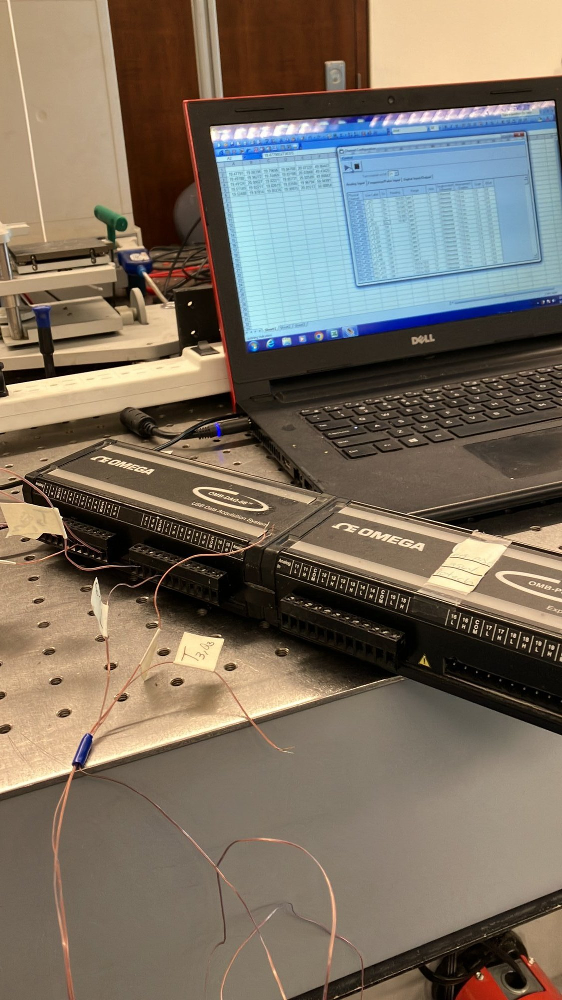
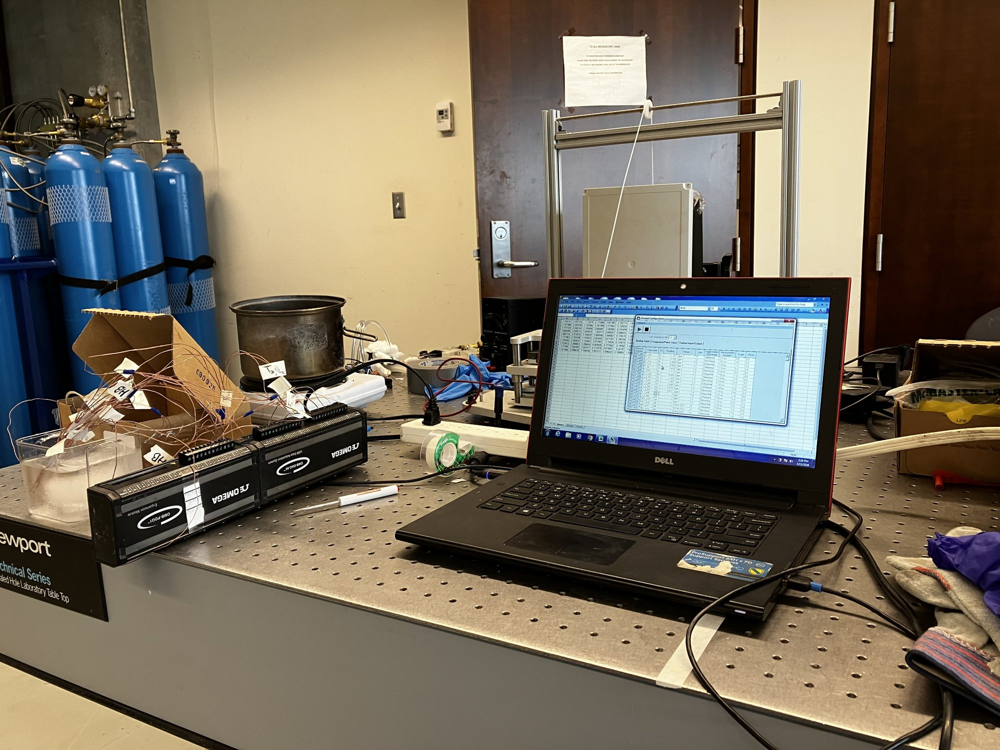

*Figure 1. The condenser block as machined: two 1/4 NPT water ports, ten clamp holes on the 85 mm pattern, and the thermocouple bores entering from the side faces.*

## Summary

A wickless flat-plate heat pipe under development at the Centre for Advanced Coating Technologies pumps fluid with a wire-arc-sprayed asymmetric sawtooth coating instead of a capillary wick. The previous build had a polycarbonate top plate that could not condense vapor, identified as the root cause of the device never reaching steady state. This report covers the replacement: a C110 copper condenser designed and machined to a GD&T drawing, the thermocouple and DAQ instrumentation of the assembly, and the first heater-to-chiller test. The test ran and logged cleanly on all channels. The gradient ran in the expected direction, but the condenser side barely moved and the chamber did not spread heat at anything like the design rate. Two measurement corrections and a known bypass in the chamber are identified, and the next experiments are specified.

| Item | Detail |
| --- | --- |
| Organisation | Centre for Advanced Coating Technologies (CACT), University of Toronto |
| Period | May 2026, summer research placement |
| Role | Design, machining, instrumentation and first test of the condenser |
| Deliverables | Drawing FPHPM2601 (Appendix A), the machined block, a calibrated 14-channel thermocouple map, the first test log |
| Tools | SolidWorks with GD&T, manual mill and drill press, NPT tapping, Omega OMB-DAQ-56 with thermocouple expansion modules, chiller, DC power supply |

## 1. Background

Modern chips produce heat fluxes that air cooling cannot remove. Vapor chambers spread that heat by evaporation and condensation, but conventional ones need a porous wick to return liquid to the hot spot. Wicks are expensive, add thickness, and fail when they dry out or clog.

The lab's approach removes the wick. An asymmetric sawtooth microstructure, sprayed onto copper, makes vapor bubbles nucleate on the long slope of each tooth. The different interface curvatures on the long and short slopes give a net Young-Laplace pressure that pushes vapor slugs in one direction. On the lab's loop heat pipe rig the thesis student had already measured that pressure directly, about 204 Pa at steady state, consistent with a 196 to 392 Pa estimate from hydrostatic head. From those results the design fixed a 200 µm air gap above the coating and a spray recipe of 9 passes for a target 1000 µm pillar height.

*Figure 2. The vapor chamber substrate with the sprayed sawtooth structure, the laser-cut silicone gasket and the thermocouple leads, being filled by syringe.*

The flat-plate device built from those results never reached steady state. Internal pressure climbed to the 25 psi relief valve and the flow became valve-driven. The polycarbonate top plate, with a conductivity around 0.2 W/m·K, gave almost no condensing surface. A copper condenser was the identified fix.

## 2. Objectives

1. Design a copper condenser that mates with the existing substrate, gasket and clamp plate, seals at 25 psi, and carries chiller water close to the vapor-side face.
2. Machine it in-house on a manual mill from solid C110.
3. Instrument the heater block, substrate and condenser with calibrated thermocouples on a DAQ so the spatial gradient can be read directly from the log.
4. Run the first heater-to-chiller test and establish whether the chamber moves heat to the condenser.

## 3. Condenser design

### 3.1 Design basis and alternatives

The condenser combines two earlier designs from the lab: the polycarbonate top plate's sealing arrangement from J. Faria's thesis, and the coolant cavity of M. Ma's condenser. Two versions were drawn with GD&T, one for 3/8 NPT fittings and one for 1/4 NPT push-to-connect fittings, each with two thermocouple bores. The 1/4 NPT version was chosen because the copper stock available set the block thickness, and the 3/8 NPT port did not fit within it.

### 3.2 Geometry

| Feature | Specification | Purpose |
| --- | --- | --- |
| Block | 90 × 90 × 17.7 mm, C110 copper | Matches the substrate footprint; copper for the condensing surface |
| Water channels | 2 × Ø11.92 mm, 55.86 mm deep, entering from opposite faces | Chiller loop close to the vapor-side face |
| Ports | 1/4 NPT: Ø11.13 mm tap drill, 17.07 mm deep, 100° countersink | Push-to-connect fittings seal on the taper without a gasket |
| Clamp holes | 10 × Ø5.30 mm through, on the 85 mm bolt pattern | Clamps the stack against the existing plate |
| Thermocouple bores | 2 × Ø1.20 mm, 25 mm deep | Beads on known lines between the vapor-side face and the water channels |

### 3.3 Tolerancing

The drawing carries the tolerances that matter for the assembly rather than blanket tight limits.

- Datum A is the vapor-side face. The bolt pattern and the channel ports carry Ø0.5 mm positional tolerances to A, B, C so the block lines up with the existing substrate, gasket and clamp plate.
- The vapor-side face has to be flat enough for the gasket to seal at 25 psi and for the contact with the chamber to conduct. The drawing controls it, but flatness was not measured after machining. This is addressed in Section 7.
- General tolerances are 0.1 mm linear and 0.5° angular.

## 4. Manufacturing

The block was machined from solid on a manual mill over one week.

| Day | Operations |
| --- | --- |
| 1 | Block squared to size in x and y |
| 2 | Faced to thickness in z; M5 clearance holes on the bolt pattern; channel positions centre-drilled |
| 3 | Thermocouples checked against ice water and boiling water (Section 5.1) |
| 4 | Channel bores drilled; ports tapped 1/4 NPT for push-to-connect fittings |
| After | Thermocouple bores; sealing face finished with light, shallow passes to keep it flat |

The Ø1.2 mm thermocouple bores, 25 mm deep, were the hardest operations. A small drill at that depth in gummy copper grabs. One bit broke and lodged in the part. The remaining bores were drilled on the mill with short pecks, clearing chips between each, and went through cleanly.

## 5. Instrumentation and test rig

### 5.1 Thermocouples and DAQ

| Item | Detail |
| --- | --- |
| Channels | 14 thermocouples across the heater block, substrate and condenser |
| Acquisition | Omega OMB-DAQ-56 with thermocouple expansion modules |
| Calibration | Two points per channel before installation: ice-water bath at 0 °C and boiling water at 100 °C |
| Channel map | Leads labelled to channel so the spatial gradient reads straight off the log |

*Figure 3. The DAQ with expansion modules and the labelled thermocouple leads.*

*Figure 4. Two-point calibration of the thermocouples against an ice bath.*

### 5.2 Test rig

A copper heater block stands in for the chip, driven by a DC power supply. The vapor chamber substrate with its gasket sits on the heater block. The condenser sits on top, plumbed to a chiller through the NPT ports. The DAQ logs all channels.

### 5.3 Planned measurements

- Temperature uniformity across the vapor chamber. Hypothesis: without a heat sink the substrate shows a gradient from centre to edge; with the condenser fitted the gradient falls below 1 °C.
- Condenser inlet and outlet temperatures, for the heat rejected to the chiller.
- Thermal resistance of the system, heater to condenser.
- Heat sink efficiency, from the rejected heat against the electrical input.

## 6. Results

Temperature data recorded cleanly on all fourteen channels. The gradient ran in the expected direction, heater block hottest and condenser coldest. The condenser side barely moved, and the substrate did not show the spreading the sawtooth structure is meant to produce, so the sub-1 °C uniformity hypothesis of Section 5.3 was not met. Heat was leaving the heater block, but not through the chamber to the condenser at anything like the design rate.

The logged data stayed with the lab and the numbers are not to hand, so this report gives the qualitative outcome only. The corrections in Section 7 are needed before the thermal resistance can be computed from that log.

## 7. Discussion

Two things are known to be wrong with the measurement.

1. Thermocouple position. Each bead sits inside the copper, not on the surface. With a known heat flux $q''$ and copper conductivity $k$ there is a linear gradient between the surface and the bead, so the surface temperature follows from the bead reading and the bead's distance $d$ from the surface on the drawing: $T_\text{surface} = T_\text{bead} + q'' d / k$. Raw bead temperatures were reported. The correction is small per channel but it is a systematic bias that changes the computed thermal resistance.
2. Interface contact. The condenser-to-chamber contact resistance was not characterised. Flatness was not measured, and no thermal interface material or contact pressure measurement was used. A poor contact could explain a large part of the missing heat transfer.

Beyond the measurement, the chamber has a known bypass. The channel walls on the substrate do not touch the sawtooth structure, giving the vapor a lower-resistance path around the pump. That was flagged in the thesis but not fixed in the hardware tested here.

Until the contact resistance and the bypass are separated from the chamber's own behaviour, the null result is a result about the rig, not about the device.

## 8. Recommendations

1. Measure the flatness of the sealing face on a surface plate or with a dial indicator. Apply the thermocouple gradient correction of Section 7 and recompute the thermal resistance from the existing log.
2. Repeat the test with thermal interface material and a torque-controlled clamp, and compare against the uncorrected run to separate contact resistance from chamber behaviour.
3. Sweep power at three levels and test both working fluids. Record condenser inlet and outlet temperatures so the heat rejected to the chiller can be closed against the electrical input.
4. Close the bypass by revising the channel boundary to contact the sawtooth structure. Add a window insert for flow visualisation if the thermal numbers justify it.

## 9. Conclusions

The copper condenser was designed, machined and installed, and the assembly was instrumented and tested end to end. The test produced a clean log and a clear qualitative result: the chamber is not yet moving heat to the condenser at the design rate. The causes cannot be assigned until the measurement chain is corrected, which is why the recommendations concentrate on where the thermocouple beads sit, how the interfaces are controlled, and closing the energy balance.

This was the first part I made to a drawing I wrote, with tolerances that came from the mating parts rather than from habit, and then had to live with in a test.

## Appendix A. Condenser drawing

[Drawing FPHPM2601, PDF](/EngineeringPortfolio/docs/cact_condenser_drawing.pdf). The drawing defines datum A as the vapor-side face, the Ø0.5 mm positional tolerances on the bolt pattern and ports, and the general tolerances of 0.1 mm and 0.5°.
