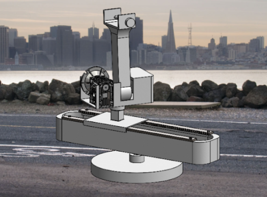

>Led requirements engineering and design space exploration for a robotic camera arm enabling repeatable Pan, Tilt, and Dolly movements for advanced hobbyist cinematographers. The system features four degrees of freedom (three independent DOFs for core movements and one redundant DOF for maintaining subject focus while panning) demonstrating kinematic optimization principles critical to my mechatronics career path. Managed the project through an ISO/IEC/IEEE 29148:2018-compliant Systems Requirements Specification (SRS) framework, achieving a $1,435 bill of materials (28% under budget) while meeting all critical performance specifications.
>**Link to career interests**: While my tendon-driven continuum robot candidate wasn't selected for final implementation, it catalyzed my interest in biomimetic robotics and compliant mechanisms, which I've since applied to NeuroTech UofT's post-stroke rehabilitation project and plan to leverage in future mechatronics and bioengineering pursuits. This project served as my introduction to formal robotics design methodology.

---

## Problem & Impact

Professional motion control rigs cost $8,000–$10,000, creating a barrier for advanced hobbyists and beginner professionals requiring precise, repeatable camera movements. This accessibility gap limits creative opportunities for emerging cinematographers and small production teams.

I led the requirements engineering process to scope a solution balancing precision, safety, and affordability. After benchmarking five state-of-the-art systems and researching three international safety standards, I established a formal SRS framework managing complexity across mechanical, electrical, and safety domains, ensuring every design decision was quantified, traceable, and verifiable.

>This project taught me how systems engineering frameworks scale complex multi-domain problems. The same traceability principles I'll need when designing integrated electromechanical systems for medical devices or autonomous systems, where failure modes must be rigorously tracked from user requirements through verification testing.

---

## Method

### Systems Requirements Specification Framework

I designed and implemented an [eight-sheet SRS system](https://docs.google.com/spreadsheets/d/1BdsVr_yOEQF0-ry8fkmVWn26BOyhL2dgDMqzKL2E2LA/edit?gid=20754991#gid=20754991) based on ISO/IEC/IEEE 29148:2018 that became our project's organizing principle:

1. **Project Dashboard** → Real-time metrics tracking
2. **User Requirements** → Foundation traced to stakeholder needs
3. **System Requirements** → 17 quantified, testable specifications
4. **Verification Matrix** → Test cases with pass/fail criteria
5. **Risk & Issues** → Technical, schedule, budget risk mitigation
6. **Bill of Materials** → Cost tracking with implementation triggers
7. **Design Decisions** → Traceable to requirements for iteration
8. **Implementation** → Action item tracking

**Bidirectional Traceability of specifications**:

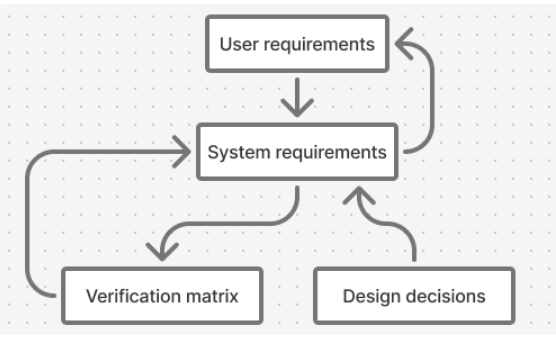

The diagram above shows how system requirements could be traced from design decisions (enabling "why did we choose this?") while design decisions traced to requirements (enabling "what if we change this?"). This structure enabled rapid iteration when our cinematographic research invalidated initial assumptions about required degrees of freedom.

Assigning team members as requirement owners automatically populated their personal tracking sheets, creating clear, automated accountability.

While the framework elevated our work to industry standards, its complexity exceeded our team's experience level. We leveraged it primarily for specification rigor rather than full project management potential. In the future, I will make sure that framework sophistication matches team capability.

>This experience with formal requirements engineering directly prepares me for medical device development, where FDA compliance demands identical traceability from clinical needs through design controls to verification testing.

---

### Research-Driven Design Strategy
I conducted secondary research into narrative filmmaking fundamentals:
- **Identified Essential Movements**: Pan, tilt, dolly, and tracking enable establishing shots, medium shots, and close-ups—the backbone of visual storytelling
- **Discovered Critical Requirement**: Maintaining subject focus while panning distinguishes professional-grade systems from hobbyist tools
- **Translated to Engineering**: 3 independent DOFs (horizontal translation, pan, tilt) + 1 redundant DOF (focus-maintaining pan) to avoid kinematic singularities
This research directly informed our iteration from an initial 5-DOF requirement down to 3+1 DOFs, reducing system complexity while maintaining functional performance.

**Competitive Benchmarking**

| System                  | Cost       | Payload | Reach    | Repeatability |
| ----------------------- | ---------- | ------- | -------- | ------------- |
| Motorized Precision EVO | $9,999     | 5kg     | 0.85m    | ±0.02mm       |
| Noxon Arm               | $8,117     | 6kg     | N/A      | ±0.01mm       |
| **Our Target**          | **$2,000** | **5kg** | **0.8m** | **±0.02mm**   |
Analysis revealed payload-reach tradeoffs are driven by motor torque limitations, guiding our NEMA 23 stepper motor selection and 20:1 gearbox requirement.

>This user-centered research methodology mirrors clinical needs assessment in medical device design. Understanding _why_ clinicians need specific features, not just _what_ features they request, leads to better solutions, which I'm trying to implement in NeuroTech UofT's stroke rehabilitation exoskeleton work.

---

### CAD Design Process: Exploring the Solution Space

I advocated for maximizing design space coverage by exploring three architectures across a maturity spectrum: both cutting-edge research to proven industrial solutions.
#### Candidate 1: Tendon-Driven Continuum Robot (My Primary Contribution)

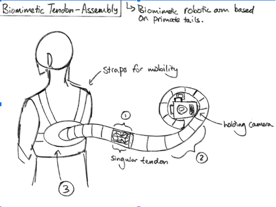 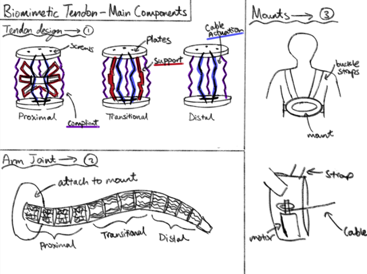
Biomimetically inspired by primate tail mechanics, featuring modular compliant segments actuated by cables rather than rigid joints.
- Designed repeating segment modules with integrated cable routing channels
- Sketched three segment types (Proximal/Transitional/Distal) with varying support rigidity
- Created wearable backpack mount integrating cable actuation motor
- Prioritized minimal self-weight through elastic deformation rather than structural rigidity

Successfully achieved 2 DOFs with inherent singularity avoidance, but failed critical specifications:
- Payload capacity: 100g vs. required 5kg (50× shortfall)
- Lacked active stabilization for smooth camera motion
- Safety concerns from arm proximity to operator body

While not selected, this exploration:
1. Reinforced self-weight minimization as a design objective team-wide
2. Demonstrated feasibility limits of novel approaches given our constraints

>Taking lead on cutting-edge design outside my comfort zone built confidence in exploring unconventional solutions, which is critical for innovation in mechatronics where cross-disciplinary inspiration (biomimetics, materials science, control theory) drives breakthroughs.
>**Career Impact**: This CAD work directly sparked my biomimetic robotics interest, leading me to design compliant finger joints for NeuroTech's rehabilitation glove. The SolidWorks skills I developed modeling elastic deformation and cable routing now enable my contributions to soft robotics and wearable device projects.

#### Candidate 2 & 3: Team Contributions

Teammates explored ball-joint ABENICS mechanisms (high precision but prohibitive cost/complexity) and 4-bar/slider designs (mature technology, good cost profile). My cinematographic research helped the team converge on a hybrid approach combining the slider's proven reliability with rotational bases achieving our required DOFs.

---

### Final Design Solution

Our selected design synthesizes insights across all candidate explorations:

**Base Rotation (Pan)** 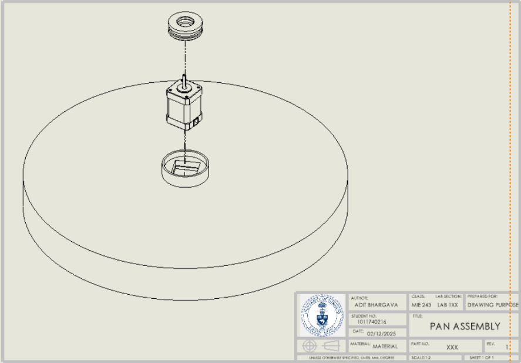NEMA 23 stepper motor drives circular base on thrust bearings, enabling 360° rotation. Stepper motor selection driven by precision requirements (±0.02mm repeatability) and holding torque for 5kg payload.

**Linear Translation (Dolly/Truck)** 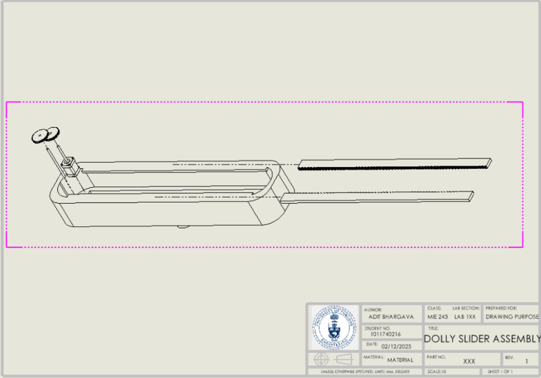Rack-and-pinion system (0.84m steel rack, acetal pinion, NEMA 23 motor). Chosen over chain drive based on research showing chains introduce stretching and vibration, which is incompatible with our precision requirements.

**Redundant Rotation (Focus-Maintaining Pan)** 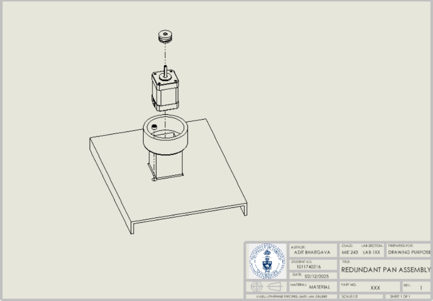 Secondary rotating base on parallel axis with radial bearings. This redundant DOF enables panning while maintaining subject focus when dolly is off-center.

**Tilt Mechanism** 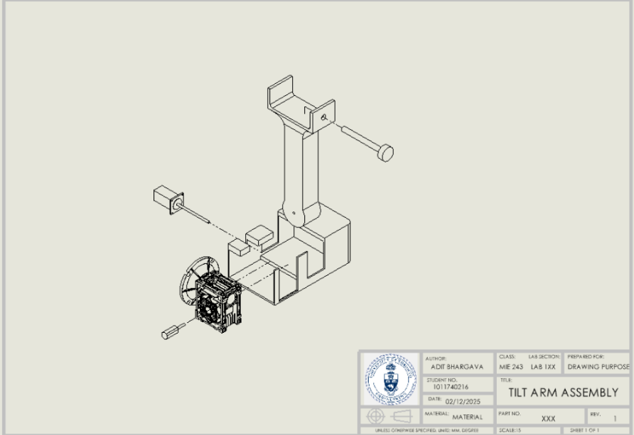Cantilevered arm driven by NEMA 23 motor with 20:1 NMRV 040 worm gearbox. FEA-optimized geometry addresses worst-case loading scenario.

---

### Design Optimization & Validation

**Material Selection: PETG for FDM Manufacturing**
Chose PETG over PLA despite slightly lower tensile strength (40–50 MPa vs. 50–60 MPa) due to superior impact resistance and strength-to-flexibility ratio under dynamic loading. This cost-effective approach enabled complex geometries impossible with metal fabrication within our budget.

>Understanding material property tradeoffs for additive manufacturing is essential for rapid prototyping in product development, which is a critical skill for my intended career path.

**Safety Integration: ISO 10218-1 Compliance**
- Shrouded all moving gears to prevent pinch points
- Filleted all accessible edges (minimum 3mm radii) to eliminate cutting hazards
- Designed for <140N transient contact force (ISO/TS 15066 pain threshold)

>This experience helped me learn to design with complete compliance with standards, which is especially important for medical device work where patient safety is paramount.

**FEA Structural Validation** (Led by teammate Lena Eys) 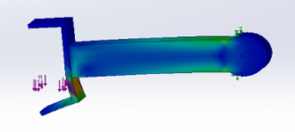 
Simulated worst-case loading: 5kg payload at maximum tilt angle. Large fillets at camera mount base reduced strain concentrations by 60%, validating load-bearing capability. This iterative CAD→FEA→redesign loop exemplifies the engineering design cycle I've now internalized.

---

### Performance Outcomes

| Specification | Target     | Achieved            | Status    |
| ------------- | ---------- | ------------------- | --------- |
| Cost          | <$2,000    | $1,435              | 28% under |
| Reach         | >0.8m      | 0.805m              | Met       |
| DOFs          | 3+1        | 3+1                 | Met       |
| Payload       | 5kg static | 5kg (FEA validated) | Met       |
| Self-Weight   | <20kg      | 28.8kg              | 43% over* |
*Topology optimization in future iterations will ensure self-weight requirement is met.

**Real-World Impact**: This design enables hobbyist cinematographers to:
- Execute repeatable multi-take shots critical for VFX compositing
- Achieve sub-millimeter precision for product advertising and stop-motion animation
- Access professional motion control at 1/7th the cost of commercial alternatives

---

## My Role & Impact in Team Leadership
### System Requirements Specifications design
- Designed ISO 29148-compliant SRS system establishing ownership tracking, risk protocols, and end-to-end traceability
- Created all eight integrated management sheets from scratch
- Trained team on framework usage and maintained system throughout project
### Benchmark & Standards Research, Specifications Iteration
- Synthesized requirements from 3 ISO safety standards + 5 competitive benchmarks
- Translated into 17 quantitative engineering specifications
- Established verification methods (Analysis/Inspection/Test) for each spec
- Conducted foundational research (Report Sections 1.1–1.3) establishing essential camera movements
- Invalidated initial 5-DOF assumption through user needs analysis
- Defined kinematic architecture: 3 independent + 1 redundant DOF
- Balanced competing priorities (cost vs. performance vs. safety)
- Maintained requirements traceability through design pivots
### Design Space Exploration
- Conceived and sketched complete tendon-driven continuum robot candidate
- Pushed team to explore biomimetic solutions before converging on conventional approach
- Surfaced compliant mechanism concepts incorporated into final stabilization design
### Teamwork Evolution: Data-Driven Growth

The spider charts below track my teammate effectiveness across two prior team projects (APS Engineering Strategies & Practice):

**ESP1 Evolution**

| Midpoint Review                    | Final Review                 |
| ---------------------------------- | ---------------------------- |
| 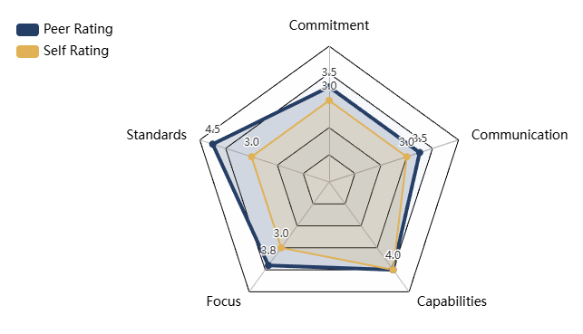 | 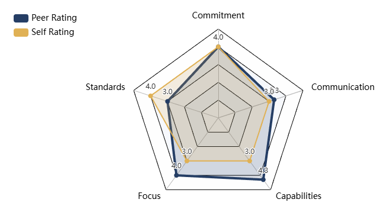 |

**ESP2 Evolution**

| Midpoint Review                    | Final Review                 |
| ---------------------------------- | ---------------------------- |
| 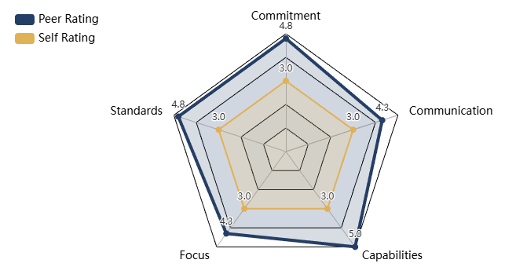 | 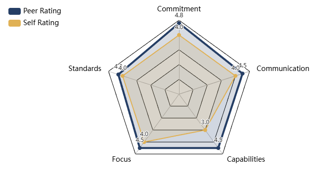 |

**Key Patterns Identified**:
1. **Increasing Value Delivery**: As I gained experience, I better aligned effort with collective needs. Implementing heuristic-based communication (e.g., "always convey more information than you think necessary") kept teams synchronized and enabled rapid action—tactics I replicated successfully in the camera arm project.
2. **Capability Blind Spot**: Consistently underestimating my abilities sometimes limited value contribution. In this project, I deliberately addressed this by leading outside my comfort zone: managing the SRS framework (project management skill gap) and designing the tendon-driven robot (cutting-edge technology gap).
>Taking project management leadership forced me to bridge my capability blind spot. The SRS framework intimidated me initially, but delivering it successfully built confidence I'll carry into future technical leadership roles in mechatronics teams.

---
## Extension & Future Work
- [ ] **Inverse Kinematics Solver** (Python/C++)
    - Implement Jacobian-based IK enabling Cartesian space control
    - Critical for intuitive operation by non-technical cinematographers
    - _Connects to my robotics coursework in controls and kinematics_
- [ ] **Computer Vision Integration**
    - Real-time object tracking for autonomous subject-following
    - Reduces operator cognitive load during complex shots
    - _Aligns with my bioengineering interest in vision-guided medical robotics_
- [ ] **Dynamic Load Optimization**
    - Current design validated for static loads only
    - Conduct fatigue analysis and motor torque verification under acceleration
    - _Reinforces need for real-world testing beyond simulation_
- [ ] **Weight Reduction via Topology Optimization**
    - Target sub-20kg self-weight for single-operator portability
    - Explore lattice structures in PETG printing
    - _Connects to lightweight design principles critical for wearable exoskeletons_

---

## Key Takeaways for Mechatronics Career

This project demonstrated how formal systems engineering frameworks enable aggressive innovation within severe constraint, achieving 3× cost reduction versus commercial alternatives while maintaining professional-grade specifications. Three insights I'll carry forward:

1. **Traceability enables agility**: The SRS framework's bidirectional tracing let us rapidly iterate when requirements changed, enabling fast-paced product development
2. **Design space exploration pays dividends**: My "failed" continuum robot sparked biomimetic interests now central to my career direction
3. **User research drives better design**: Understanding _why_ cinematographers need features, not just _what_ they request, led to our redundant DOF innovation.

>The systems engineering rigor, CAD proficiency, and teamwork leadership I developed here directly enable my contributions to NeuroTech's rehabilitation robotics and my long-term goal of designing accessible assistive technologies. This project set a high bar for documentation and traceability that I'll maintain throughout my engineering career.