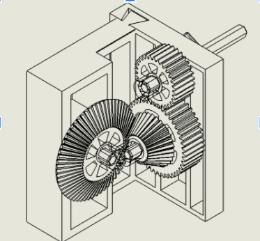
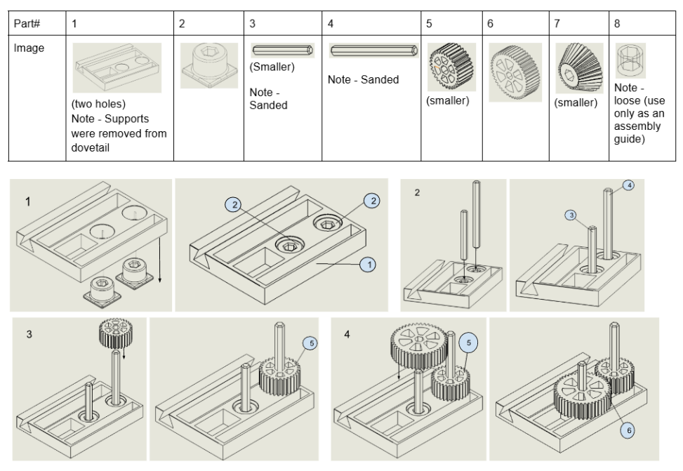
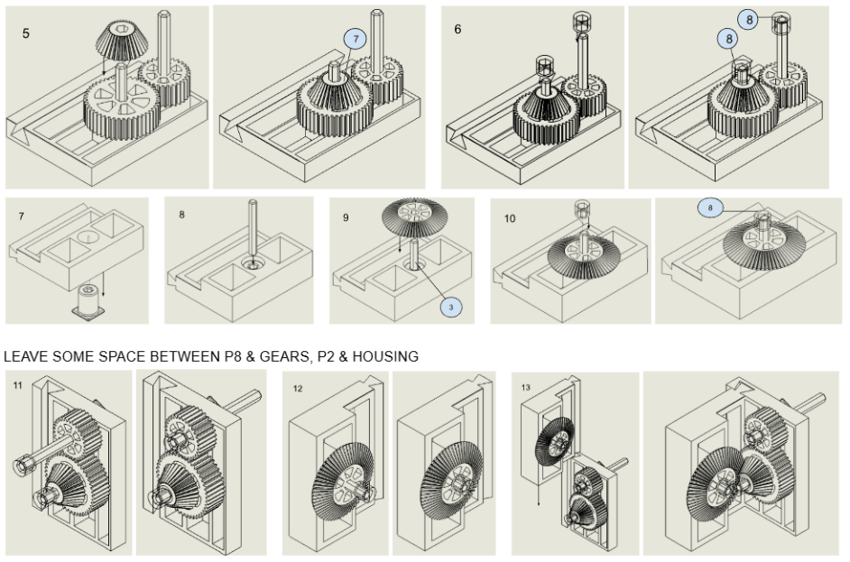

>Formulated and solved a Mixed-Integer Nonlinear Programming (MINLP) problem to optimize a two-stage compound gear train for 3D printing. Used a Differential Evolution algorithm with "maximin" objective function to navigate ~10^6 design combinations, maximizing the minimum safety factor across the assembly. The resulting design achieved a 3:1 reduction ratio with minimum safety factor of 951 (Hertzian contact stress), fitting within a 125mm build volume and 6-hour print budget.
>**Link to career interests:** This project taught me computational design optimization for manufacturing constraints, which is directly applicable to my interest in robotics and automated manufacturing. The constraint-handling approach I developed here (balancing structural performance with build time and geometric limits) mirrors the multi-objective optimization problems I want to solve in production robotics, where cycle time, material cost, and reliability must all be simultaneously optimized.

## Problem

Designing load-bearing gear trains for Fused Deposition Modeling (FDM) presents challenges that don't exist with traditional machined gears. PLA parts have anisotropic strength (layer lines create weak planes), lower thermal limits (60°C glass transition vs 200°C+ for steel), and specific manufacturing constraints: print time matters for production scalability, bed adhesion limits geometry, and 0.4mm nozzle resolution affects minimum feature sizes.

Manual design typically produces one of two failure modes:

- Over-engineered parts with excessive safety margins that waste material and print time
- Under-engineered parts that fail at layer lines under load

**Design objective:** Mathematically derive optimal gear geometry that maximizes structural integrity (via safety factor) while strictly meeting the geometric and temporal constraints of Myhal 3D printers (125mm circular build volume, 6-hour print time budget).

## Method

### Problem Formulation: Mixed-Integer Nonlinear Programming

I classified this as an MINLP problem because the decision variables span multiple data types:

- **Discrete:** Module sizes (standard metric series: 0.5, 0.6, 0.7... mm per ISO 54)
- **Integer:** Tooth counts ($z$, must be whole numbers for geometric closure)
- **Continuous:** Face widths ($b$) and ratio split factor ($r_{split}$​ between stages)

Traditional gear design uses lookup tables and empirical rules (e.g., "module should be 1/20th of pitch diameter"). I wanted to test whether algorithmic optimization could find non-intuitive solutions that outperform these heuristics.

### Research: AGMA Standards Adapted for Plastics

Before writing any code, I spent two weeks reviewing literature on plastic gear design. The American Gear Manufacturers Association (AGMA) publishes stress equations for steel gears, but these needed modification for PLA:

1. **Bending Stress (Lewis Form Factor):** Predicts tooth breakage at the root fillet. I used AGMA 908-B89 equations but substituted PLA material properties (tensile strength 37 MPa vs 400 MPa for steel, modulus 3.5 GPa vs 200 GPa).
2. **Contact Stress (Hertzian):** Predicts surface pitting and wear. Used AGMA 218.01 with surface hardness adjusted for PLA Shore D hardness (~75 vs 300+ BHN for hardened steel).

The literature survey revealed that FDM gears typically fail in contact stress before bending stress due to layer-to-layer bonding weaknesses. This informed my decision to use a "maximin" objective focusing on the weakest failure mode.

### Objective Function: Maximin Strategy

Standard optimization maximizes average performance. I rejected this because gear trains fail at their weakest component: a stage with SF=10 and a stage with SF=1000 still fails when the weak stage breaks.

Instead, I maximized the minimum safety factor found anywhere in the system:

$\text{Maximize: } s$
$\text{Subject to: } \min(S_{b,i}, S_{H,i}) \geq s \quad \forall i$
where $S_b$​ is bending safety factor and $S_H$​ is Hertzian contact safety factor for each stage $i$.

### Algorithm Selection: Differential Evolution

The search space is non-convex (local minima exist), constrained (bed size, print time), and mixed-integer. Gradient-based methods won't work. I evaluated three evolutionary algorithms:

- **Genetic Algorithm:** Good for discrete variables but slow convergence
- **Particle Swarm:** Fast but poor constraint handling
- **Differential Evolution:** Best balance for mixed-integer problems with penalty-based constraints

I implemented DE using SciPy with the following parameters:

|Parameter|Value|Rationale|
|---|---|---|
|Strategy|`best1bin`|Exploitation-focused for convergence speed|
|Population Size|105 individuals|15× problem dimension (7 variables) per DE literature|
|Generations|300 iterations|Convergence plateau observed at ~250 iterations|
|Mutation Factor (F)|0.8|Standard DE parameter|
|Crossover Rate (CR)|0.7|Balances exploration vs exploitation|

**Constraint handling:** Implemented penalty method that degrades fitness score by 10^6 for any solution violating geometric boundaries (bed diameter >125mm) or build time >6 hours. This effectively removes infeasible solutions from the breeding pool.

## Solution

### Optimization Results

The algorithm converged on a solution that contradicted typical FDM design intuition. Most printed gears use large modules (2-3mm) for "strength." The optimizer selected a **small module strategy** (0.5mm) with high tooth counts instead.

**Why this works:** Small modules minimize pitch diameter for a given reduction ratio. Compact gearboxes have shorter shaft spans, which reduces bending deflection and improves mesh alignment. The trade-off is manufacturing complexity (small teeth near nozzle resolution limits), but the optimizer determined this was acceptable.

Final gearbox assembly with DFMA optimized housing designed by teammates:

### Performance Metrics

|Parameter|Result|% of Limit|
|---|---|---|
|Reduction Ratio|3.000:1|100% (exact target)|
|Minimum Safety Factor|951.93 (Contact, Stage 2)|-|
|Bending Safety Factor|>11,000,000|-|
|Maximum Diameter|30.0 mm|24% of 125mm limit|
|Print Time|2.82 hours|47% of 6hr budget|
|Material Used|28g PLA|-|

**Limiting factor:** The design is constrained by Hertzian contact stress at Stage 2 with SF=951. Bending stress has SF>10 million, meaning tooth breakage is statistically impossible under the specified 5 Nm input torque.

**Safety margin rationale:** A safety factor of 951 seems excessive compared to typical steel gears (SF=2-3). However, FDM parts exhibit high variability:

- Void percentage varies ±15% depending on print settings
- Moisture absorption degrades PLA strength by 10-25%
- Layer adhesion depends on bed temperature, which drifts ±5°C

The high SF accommodates this uncertainty. Physical testing would determine if this margin can be reduced.

### Design Features from Optimization

**Balanced load distribution:** The algorithm selected ratio split of 1.5:1 (Stage 1) and 2.0:1 (Stage 2) rather than placing all reduction in one stage. This prevents one stage from becoming a massive failure point while the other is underutilized. I didn't impose this constraint—the optimizer discovered it naturally.

**Compact geometry:** The 30mm maximum diameter is 76% under the bed size limit. This leaves room for housing walls and mounting features, which my teammates designed. The small footprint also reduces warping during printing (edge sections cool faster than centers, causing delamination).

## CAD Development and Iteration

I modeled all four gears in SolidWorks using the optimization output parameters. The modeling process involved:

1. **Involute profile generation:** Used SolidWorks equation-driven curves to generate true involute tooth profiles based on the 0.5mm module and pressure angle (20° standard)
2. **Web design:** Added 6-spoke webs inside each gear to reduce print time without affecting tooth strength. Web thickness (2mm) was chosen empirically.
3. **Shaft coupling:** Designed hex-shaft interfaces to prevent slipping under torque. This required tolerance analysis because FDM dimensional accuracy is ±0.2mm.

## Teamwork and Collaboration

**My responsibilities:**

- Optimization algorithm development (Python/SciPy code)
- All gear CAD modeling (4 gears with involute profiles)
- Assembly instructions documentation

**Collaborative work:**

- My teammates designed the housing that encloses the gear train. They created the overall assembly in SolidWorks and managed version control. 
- They also printed the parts and carried out DFMA optimization using the guidance in the deliverables document

**Documentation work:** I created [assembly instructions](https://docs.google.com/document/d/1G6eaIqDjWRjSXjXO8OqMMjGxj0i5qIlwevrQheYqX7o/edit?tab=t.0) with step-by-step photos and torque specifications. This enabled assembly in 2.5 minutes. Writing clear technical documentation is something I hadn't prioritized before this project, but during testing we realized our design isn't fully intuitive and needs clearly defined assembly instructions.

## Extension: Moving Toward Production

Three developments needed before this design is production-ready:

**1. Topology Optimization for Web Geometry**  
Currently, the gear webs use simple 6-spoke designs I chose empirically. Topology optimization (using FEM solvers like Altair OptiStruct) could remove additional material from low-stress regions without affecting structural performance. Literature suggests 20-30% mass reduction is achievable, which would proportionally reduce print time. I want to learn this technique because it's standard practice in aerospace and automotive lightweighting.

**2. Physical Validation Testing**  
The AGMA equations predict SF=951, but we haven't validated this with destructive testing. Planned test: mount the gearbox on a torque test stand, incrementally increase load until failure, and measure actual failure torque vs predicted failure torque. This would either validate our material property assumptions or reveal that we need better characterization of FDM PLA under cyclic loading.

**3. Material Exploration**  
PLA was chosen for availability, but other FDM materials might perform better. Nylon has higher impact resistance (better layer adhesion), PETG has better creep resistance (important for sustained loads). However, each material has different thermal expansion coefficients, which affects dimensional accuracy. Understanding this trade-off space would enable material selection optimization, not just geometric optimization.

> These extensions matter because they represent the gap between academic optimization and deployable engineering. I'm interested in robotics and automated manufacturing, where computational design tools like this must integrate with physical validation, material science, and production scalability. Learning to bridge that gap—knowing when simulation is sufficient and when physical testing is required—is the skill I want to develop.

---
## Appendix: Design Variables and Constraints

| Variable Type  | Parameter                           | Range/Set                                                       | Final Value      |
| -------------- | ----------------------------------- | --------------------------------------------------------------- | ---------------- |
| **Discrete**   | Module (mm m)                    | {0.5,0.6,...,5.0}\{0.5, 0.6, ..., 5.0\} {0.5,0.6,...,5.0} mm | 0.5 mm           |
| **Integer**    | Pinion Teeth Stage 1 (z1z_1 z1​) | [12,80][12, 80] [12,80]                                      | 24               |
| **Integer**    | Gear Teeth Stage 1 (z2z_2 z2​)   | [12,80][12, 80] [12,80]                                      | 36               |
| **Integer**    | Pinion Teeth Stage 2 (z3z_3 z3​) | [12,80][12, 80] [12,80]                                      | 18               |
| **Integer**    | Gear Teeth Stage 2 (z4z_4 z4​)   | [12,80][12, 80] [12,80]                                      | 36               |
| **Continuous** | Face Width (bb b)                | [5,50][5, 50] [5,50] mm                                      | 12 mm            |
| **Constraint** | Bed Diameter                        | ≤125\leq 125 ≤125 mm                                         | 30 mm (76%)      |
| **Constraint** | Build Time                          | ≤6.0\leq 6.0 ≤6.0 hours                                      | 2.82 hours (47%) |
| **Constraint** | Aspect Ratio (b/db/d b/d)        | ≤0.5\leq 0.5 ≤0.5                                            | 0.4              |