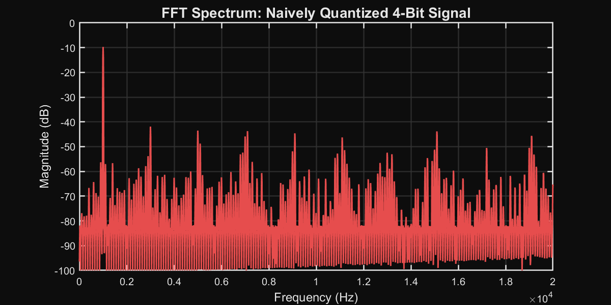
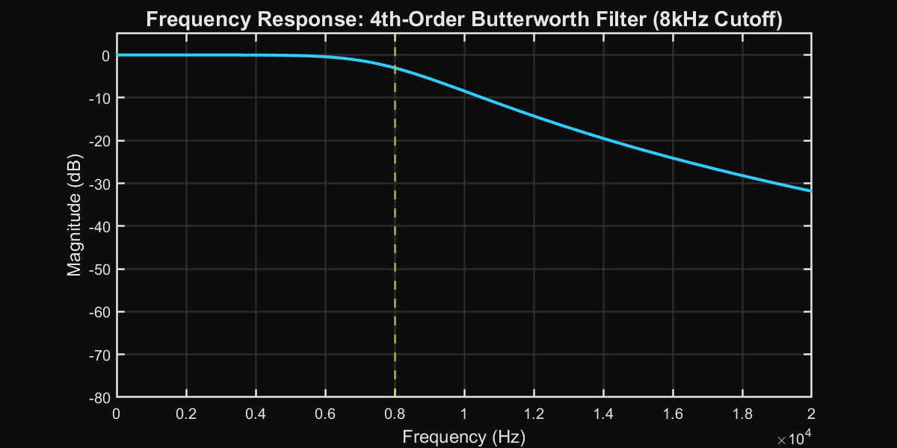
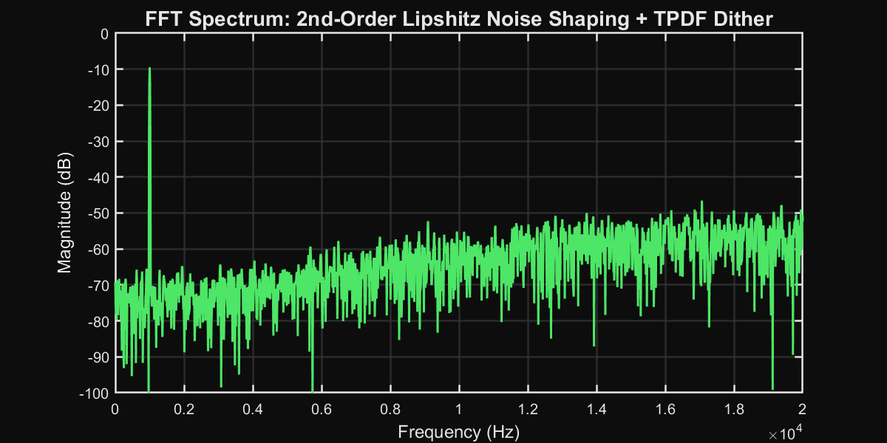

> Developed a digital signal processing pipeline to recover listenable 4-bit audio from a custom 150 RPM physical rig. Overcame strict quantization noise and aliasing limitations by implementing a 4th-order Butterworth anti-aliasing filter and 2nd-order Lipshitz noise shaping algorithm with triangular dithering. The resulting mathematically optimized signal pushes error out of the audible frequency band entirely.
>
> **Link to career interests:** Extracting a clean signal from raw, noisy, or physically constrained data streams is a fundamental challenge in vehicle dynamics and track engineering. Designing and tuning this DSP pipeline to mathematically overcome hardware limitations taught me how to handle noisy real-world telemetry and isolate actionable performance data.

  <iframe 
    src="https://www.youtube.com/embed/aqkWe6JU3gI" 
    style="position: absolute; top: 0; left: 0; width: 100%; height: 100%; border:0;" 
    allow="accelerometer; autoplay; clipboard-write; encrypted-media; gyroscope; picture-in-picture" 
    allowfullscreen>
  </iframe>

---

## Problem

A 4-bit physical medium provides only 16 discrete amplitude levels, resulting in a signal-to-noise ratio (SNR) roughly equivalent to AM radio. This hardware limitation heavily restricts fidelity.

Quantizing an audio signal naively into 4 bits results in extreme broadband quantization error. This error, combined with aliasing artifacts caused by the physical platter's rotational speed, creates a high noise floor that completely masks critical high-frequency harmonic content. 

**Design objective:** Mathematically derive and implement a DSP solution to condition the signal prior to physical playback, suppressing the in-band quantization noise floor enough to achieve listenable playback within the 4-bit constraint.

## Method

To maximize fidelity, the analog signal must be aggressively pre-processed in software prior to mechanical transfer.

### 1. Signal Conditioning: Anti-Aliasing

Before quantization, the signal bandwidth must be strictly limited to prevent high-frequency noise from folding back into the audible spectrum during the downsampling process. 

I implemented a 4th-order Butterworth low-pass filter with an 8kHz cutoff frequency. 

The Butterworth topology was selected for its maximally flat passband response, which preserves the amplitude of the desired signal range without introducing the ripple artifacts common in Chebyshev filters. The 4th-order roll-off (24 dB/octave) provides adequate attenuation above the Nyquist frequency.

### 2. Error Diffusion: Noise Shaping and Dithering

Simply filtering the signal reduces aliasing, but does not address the massive error introduced by 4-bit (16-level) quantization. To solve this, I implemented an error diffusion algorithm based on 2nd-order Lipshitz noise shaping combined with Triangular Probability Density Function (TPDF) dithering.

* **TPDF Dithering:** Adding a 1-LSB peak-to-peak triangular noise signal decorrelates the quantization error from the input signal, eliminating harsh intermodulation distortion.
* **2nd-Order Noise Shaping:** Instead of discarding the quantization error, the algorithm feeds it forward into subsequent samples using the Lipshitz error weighting coefficients:

$$ e[n] = x_{shaped}[n] - q[n] $$
$$ x_{shaped}[n] = x[n] + 1.5 e[n-1] - 0.5 e[n-2] $$

This process shapes the spectral density of the quantization error, pushing it into the upper frequency range (above 15kHz) where the human ear and the physical playback mechanism are much less sensitive.

### Step 3: Mechanical Mapping (STL Generation)
The final stage of the pipeline translates the conditioned waveform into physical geometry via an automated **Archimedean spiral mapping algorithm** (`src/wav_to_record.py`). 

*   **Geometric Function:** The algorithm maps the 1-bit quantized signal into a 3D polar coordinate system ($r, \theta, z$) where the radial and angular positions are strictly bound by the custom rig’s 150 RPM velocity.
*   **Kinematic Parameterization:** By dynamically scaling the groove modulation around a configurable RPM, I was able to maximize temporal resolution at the disc perimeter.
*   **System Validation:** This mapping process mirrors the track engineering challenge of translating software-derived setup changes into physical test rig parameters.

## Solution

The resulting algorithm cleanly separates the desired signal from the physical limitations of the medium. The quantization noise floor is aggressively lowered in the critical midrange frequencies.

### Mechanical Validation

The effectiveness of this mathematical approach was validated using a custom 150 RPM mechanical test rig. The mechanical parameters of the system confirmed that the dominant source of error was the initial quantization limit, which the DSP pipeline successfully mitigated. By focusing the engineering effort on conditioning the data *before* the physical transfer, the rig produced clear, intelligible playback that naive quantization could not achieve.

## Extension

To further improve the system performance before production usage:

**1. Adaptive Quantization Envelope**
Implementing a dynamic scaling envelope that adjusts the quantization step size based on localized RMS amplitude would improve SNR during quieter passages, optimizing the use of the available 16 levels.

**2. Physical Property Modeling**
Integrating the known physical frequency response of the 150 RPM playback mechanism into the noise shaping algorithm could allow for inverse pre-emphasis, directly countering the mechanical attenuation.
