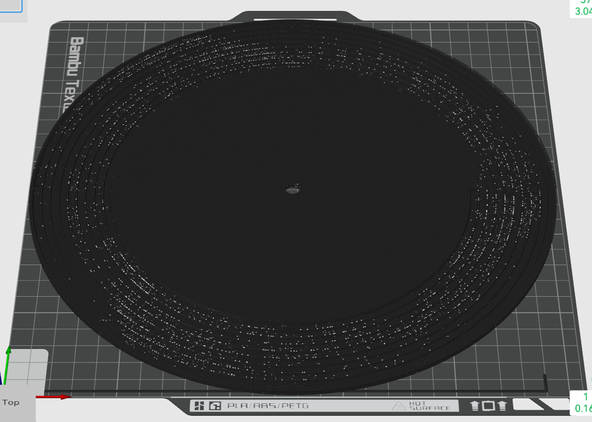
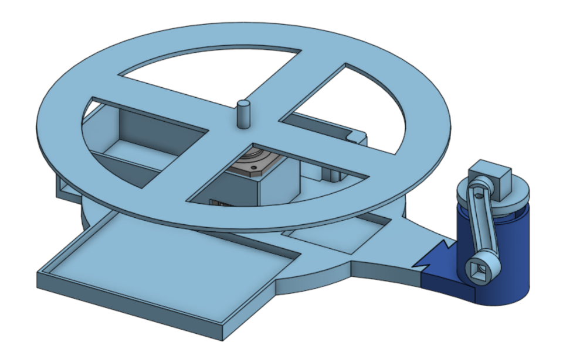

> Designed and implemented a complete pipeline for encoding audio as FDM-printable groove geometry. The central problem is mesh generation: converting a continuous audio waveform into a valid, watertight, triangulated Archimedean spiral solid with correct manifold closure at four distinct boundary regions. Groove parameters are derived bottom-up from what the FDM process can physically resolve — extrusion width sets lateral feature size, layer height sets Z quantization, and land width must exceed one extrusion width or adjacent grooves bleed together. Hertzian contact analysis confirms the ceramic stylus plastically deforms the PLA groove floor on first play, bounding the useful geometric precision. The signal conditioning pipeline is a consequence of these physical constraints, not a design driver.

<!--

  <iframe 
    src="https://www.youtube.com/embed/aqkWe6JU3gI" 
    style="position: absolute; top: 0; left: 0; width: 100%; height: 100%; border:0;" 
    allow="accelerometer; autoplay; clipboard-write; encrypted-media; gyroscope; picture-in-picture" 
    allowfullscreen>
  </iframe>

-->
---

## Problem

FDM 3D printing cannot produce lateral-cut vinyl grooves. The nozzle deposits material as a bead with width $w_e \approx 1.2 \times d_{\text{nozzle}}$ — this is the minimum XY feature the process can resolve, and it is roughly 10× coarser than a conventional vinyl groove wall. V-cut geometry is not achievable. The only available modulation axis is Z: vertical displacement of the groove floor in discrete layer-height increments.

This axis change redefines the entire design problem. The groove is no longer a lateral wiggle in a flat plane — it is a helical trench whose floor height varies in 0.08 mm steps. Every downstream parameter (sample rate, bandwidth, dynamic range, groove pitch, land width, mesh topology) derives from two hardware inputs: nozzle diameter and layer height. The signal processing is the last thing designed, not the first, because what it must become is fully determined by what the fabrication process and the playback contact mechanics allow.

**Design objective:** Starting from the physical constraints of the FDM process and the stylus-groove contact, derive the groove geometry that satisfies both manufacturability and trackability, generate a valid watertight mesh encoding audio into that geometry, and design the minimal signal conditioning pipeline that operates within the resulting bandwidth and dynamic range.

## Method

### STL Mesh Generation and Groove Topology

The hardest part of this project is turning a continuous audio waveform into a valid, watertight, printable triangulated solid. The groove follows an Archimedean spiral $r_c(\theta) = r_0 - \frac{p}{2\pi}\theta$, where $p$ is the groove pitch. At each angular step, the waveform sample sets the groove floor height. The mesh must be a closed 2-manifold — every edge shared by exactly two triangles, no holes, no self-intersections — or the slicer will reject it or produce unpredictable infill.

**Vertex layout.** Each angular step generates six vertices defining the groove cross-section: outer wall top (at $Z_{\text{surface}}$), groove floor center (at $Z_{\text{base}} + (s + n_{\min}) \cdot h$, where $s$ is the quantized sample value), inner wall top (at $Z_{\text{surface}}$), outer wall bottom (at $Z = 0$), inner wall bottom (at $Z = 0$), and groove center projected to land height (at $Z_{\text{surface}}$). Between consecutive angular steps, these vertices form the quad strips that define the groove walls, floor, and land surfaces.

**Face construction.** Each angular step produces approximately 10 triangles: two each for the outer groove wall, inner groove wall, and bottom face (three quad strips), plus two each for the outer and inner land surfaces at $Z_{\text{surface}}$. For a 60-second recording at 78 RPM with a 0.2 mm nozzle, this totals approximately 680,000 angular steps and ~6.8 million triangles.

**The four manifold closure boundaries.** The spiral helix has no natural closure — it starts at the outer radius and terminates at the inner radius with open edges at both ends and along both radial boundaries. Each must be explicitly sealed:

1. **Start cap** (spiral origin at outer radius): The cross-section at $\theta = 0$ is an open polygon. Three triangles close the groove profile — outer wall to floor, floor across the bottom, floor to inner wall — with face normals oriented outward along the starting tangent direction.

2. **End cap** (spiral terminus at inner radius): Identical geometry to the start cap but at the final angular step, with reversed winding order so normals point in the opposite tangent direction. Getting the winding order wrong here produces an inward-facing cap that the slicer interprets as a hole.

3. **Outer rim** (the flat annular region between the record's outer edge and the first groove turn): Triangulated as quad strips connecting the record's outer circumference to the first turn's outer groove wall, with corresponding bottom face and vertical outer wall closure. This region has uniform $Z_{\text{surface}}$ height — no modulation.

4. **Inner disk** (the flat region between the last groove turn and the spindle hole): Connects the final turn's inner groove wall to the spindle hole circumference. Same construction as the outer rim but at the inner radius, closing the bottom face and the spindle hole wall.

**Inter-turn land bridging.** Between adjacent turns of the spiral, the land surface (the flat region between one turn's inner wall and the next turn's outer wall) must be explicitly triangulated at $Z_{\text{surface}}$. This requires indexing back one full revolution ($i - \text{steps\_per\_rev}$) at each angular step to find the corresponding edge of the previous turn and constructing a bridging quad between the two edges. If this bridging is omitted, each turn is a separate shell floating in space — the mesh is not a solid and the slicer will either fail or fill the gaps with infill.

**Sign convention.** The Z-mapping must guarantee $Z_{\text{floor}} < Z_{\text{surface}}$ for all valid sample values. Sample value $s \in [0, 2^n - 1]$ maps to $Z_{\text{floor}} = Z_{\text{base}} + (s + n_{\min}) \cdot h$, where $n_{\min}$ is a minimum thickness buffer (2 layers) preventing the groove floor from coinciding with the record base. Inverting the sign convention (mapping high sample values to high Z) would produce grooves that protrude above the land surface — the stylus rides over them instead of tracking in them. Self-intersection between turns is provably impossible given this mapping, since the maximum floor height is always below $Z_{\text{surface}}$.

### Stylus Contact Mechanics and Groove Degradation

The printed groove must survive contact with the playback stylus. Hertzian contact analysis between a spherical stylus tip ($R = 0.018$ mm, standard vinyl stylus) and the PLA groove floor at $F = 0.04$ N (4 g vertical tracking force) with $E^* = 3.85$ GPa yields contact radius $a = (3FR / 4E^*)^{1/3} \approx 5.2$ µm and peak contact pressure $p_{\max} = (6FE^{*2} / \pi^3 R^2)^{1/3} \approx 230\text{–}280$ MPa. This is 4–5× PLA's compressive yield strength (~50 MPa). The contact patch is approximately 10 µm in diameter — the stylus concentrates the tracking force on an extremely small area of the groove floor, and the PLA yields locally on first contact.

This is a materials problem with direct implications for how tight the geometry needs to be. The groove floor deforms substantially on first play: the encoded Z geometry is partially destroyed in each ~10 µm contact patch as the stylus traverses the spiral. The geometry must be printed at full 4-bit resolution knowing that the first contact will plastically set the groove floor in every region the stylus touches. Effective bit depth degrades from 4 bits toward 3 bits in the contact track. Progressive abrasive wear is a separate and slower mechanism; first-play plastic set is the dominant irreversible geometric change.

A spherical stylus tip of radius $R$ also imposes a geometric bandwidth limit independent of print resolution. The tip cannot resolve groove floor features with spatial wavelength shorter than $2\pi R$, giving $f_{\text{geometric}} = r \cdot \text{RPM} / (60 \cdot R)$. At $R = 0.018$ mm, $f_{\text{geometric}} \approx 2{,}889$ Hz at the inner radius (40 mm) and $\approx 8{,}667$ Hz at the outer radius (120 mm). Both values exceed the corresponding Nyquist limits (681 Hz and 2,042 Hz) by approximately 4×. The stylus geometric filter is therefore non-binding: Nyquist — set by the print resolution — governs the system bandwidth at all radii.

However, an 18 µm stylus tip was designed for commercial vinyl grooves of 25–55 µm width. The FDM groove is 240–480 µm wide — 10–20× wider than intended. Whether the stylus tracks stably on the groove floor or rattles, chatters, or rides the groove walls instead is an open experimental question with no analytical answer. This must be characterized empirically on the printed geometry.

### FDM Manufacturing Constraints and Tolerances

The fabrication process imposes hard floors on every geometric parameter. These are manufacturing realities, not design choices.

**XY resolution.** Extrusion width $w_e = 1.2 \times d_{\text{nozzle}}$ sets the minimum lateral feature size. For a 0.2 mm nozzle, $w_e = 0.24$ mm. This is the groove width — it cannot be made narrower.

**Z resolution.** Layer height (0.08 mm) is the quantization step size. Each step is one bit of depth resolution. At 4-bit depth (16 levels), total Z modulation range is $16 \times 0.08 = 1.28$ mm. Z positioning accuracy of $\pm 0.02$ mm means the bottom 1–2 bits may be unreliable — effective bit depth may be 3 bits (18 dB dynamic range) rather than 4 bits (24 dB).

**Land width.** Groove pitch $p \geq 2 \times w_e$ ensures the land between adjacent grooves is at least one extrusion width. If land width falls below $w_e$, the slicer cannot deposit a distinct bead between grooves — they bleed together into a single trench.

**Slicer segment merging.** At the inner radius (40 mm) with a 0.2 mm nozzle, the arc length per angular step is 0.24 mm. This approaches the slicer's minimum segment length threshold (0.1–0.4 mm in Bambu Studio). If the slicer merges adjacent segments, angular resolution at the inner radius degrades — steps are dropped from the G-code, and the groove floor loses sample points. This is a fabrication artifact that cannot be corrected downstream.

**Staircase noise.** The Z-axis layer-height staircase produces a periodic surface texture with spatial period equal to the layer height. This generates a tonal noise component at $f = v / h$, where $v$ is the groove tangential velocity and $h$ is the layer height. At the inner radius, this falls at approximately 4,088 Hz — above the system's Nyquist but within the stylus's mechanical response. This is a mechanical noise source inherent to FDM; it is not removable by any signal processing applied to the input audio.

### Bandwidth Derivation from Groove Geometry

The angular resolution of the printed groove is set by the minimum distinguishable arc length, which equals $w_e$:

$\text{steps\_per\_rev} \leq \frac{2\pi r}{w_e}$

Sample rate follows directly as $f_s = \text{steps\_per\_rev} \times \text{RPM} / 60$. For a 0.2 mm nozzle ($w_e = 0.24$ mm) at 78 RPM:

| | Inner radius (40 mm) | Outer radius (120 mm) |
|---|---|---|
| Steps/rev | 1,047 | 3,142 |
| $f_s$ | 1,361 Hz | 4,085 Hz |
| Nyquist | 681 Hz | 2,042 Hz |

Bandwidth is radius-dependent: outer grooves encode 3× the frequency content of inner grooves. This is a geometric consequence of the spiral — the system's effective capability varies continuously across the disc surface.

A sinusoidal signal at frequency $f$ and amplitude $A$ has maximum groove floor slope $2\pi f A / v$. Setting this equal to the maximum trackable slope $\tan(\theta_{\max})$ gives the amplitude-frequency tradeoff:

$A \cdot f \leq \frac{\tan(\theta_{\max}) \cdot r \cdot \text{RPM}}{60}$

At 500 Hz, $\theta_{\max} = 45°$, and $r = 40$ mm, this yields $A_{\max} = 1.3$ quantization levels. At the inner radius, the slope limit — not the bit depth — is the binding constraint on dynamic range.

### Signal Conditioning Pipeline

With every physical constraint established, the signal conditioning pipeline is whatever the remaining design space allows. At the inner radius, the audio band (300–681 Hz) fills the entire Nyquist range. There is zero spectral headroom. Lipshitz-style noise shaping, which redistributes quantization error out of the audio band, cannot work — shaped noise has nowhere to go except back into the passband via aliasing. This forced a minimal pipeline:

| Stage | Parameter | Derivation |
|---|---|---|
| Highpass filter | 300 Hz, 4th-order Butterworth | Content below 300 Hz has no harmonics within [681, 2042] Hz; informationally inert |
| Lowpass filter | 681 Hz, 4th-order Butterworth | Inner-radius Nyquist limit (conservative global cutoff) |
| Dynamic range compression | ≥ 6:1 ratio | Compress 24 dB input to ≤ 18 dB to accommodate slope constraint |
| Dithering | TPDF only (no noise shaping) | Zero Nyquist headroom precludes spectral redistribution |

The 300–681 Hz passband means most musical fundamentals cannot be directly encoded. The auditory system, however, reconstructs pitch from harmonics 2–4 if the signal is monophonic and periodic. Harmonics 2–4 of a ~400–550 Hz fundamental (A4–C#5) fall within the bandwidth window, defining the optimal input selection range.

### Playback Hardware

The turntable is not off-the-shelf. The initial version was built by Samantha Chan (mechanical CAD), and Niegel Fernandes (electronics). The next iteration is currently being built to accommodate more robust and compact electronics compatible with the derived constraints.

The core hardware requirements derive from the constraint analysis and the validation protocol. RPM stability must stay within ~5%, because beyond that, measured fundamental frequency drifts past ±50 cents (the Level 3 validation threshold). This sets the motor control problem: motor selection, platter inertia sizing, and whether closed-loop speed regulation is necessary or whether a sufficiently high-inertia platter with an open-loop DC motor provides adequate stability. The redesign is working through this tradeoff.

The ceramic cartridge output is a high-impedance, low-voltage signal that requires a preamplifier stage before any signal capture or measurement. A custom PCB integrates motor speed control and cartridge preamplification onto a single board. This PCB is being redesigned as part of the rebuild.

## Solution

Initial validation on the first turntable confirmed that the physical constraints predicted actual system behavior. The inner-radius bandwidth limit, the slope-induced amplitude ceiling, and the first-play plastic deformation all appeared where the geometry analysis said they would. The mesh generation pipeline produces watertight STL files that slice without error and print as continuous groove geometry — inter-turn land bridging, manifold closure at all four boundaries, and correct sign convention are all verified by slicer import and visual G-code inspection.

That turntable has since been disassembled. The redesigned version currently in progress targets proper closed-loop validation against the three-tier protocol defined below. The playback transfer function $H(f)$ remains unmeasured, and the current pipeline uses a conservative global cutoff rather than per-turn adaptive filtering, so there is usable bandwidth on the outer grooves that the system leaves on the table. Both are addressable once the rebuild is complete and producing recorded output.

## Extension

### 1. Adaptive Per-Turn Lowpass Filter

The current pipeline uses the conservative inner-radius Nyquist (681 Hz) globally. Applying a per-turn adaptive cutoff $f_{\text{LP}}(r) = \pi r \cdot \text{RPM} / (60 \cdot w_e)$ would recover up to 3× bandwidth on outer grooves. This requires overlap-add windowing at turn boundaries to avoid phase discontinuity artifacts.

### 2. Measured Pre-Emphasis

The playback transfer function $H(f)$ is currently unknown. A sine sweep test record (300–2,042 Hz, 50 Hz steps) would allow designing an inverse pre-emphasis filter $H^{-1}(f)$ to directly counter the mechanical frequency response.

### 3. Closed-Loop Validation Protocol

Three-tier success criteria, and the primary target for the turntable rebuild:

| Level | Criterion | Requirement |
|---|---|---|
| 1 | Pitch contour recognition | 3/5 naive listeners identify the melody |
| 2 | SNR measurement | SNR > 6 dB in the 400–2,042 Hz band vs. blank groove noise floor |
| 3 | Frequency accuracy | Measured fundamental frequency within ±50 cents (requires RPM stability < 5%) |
